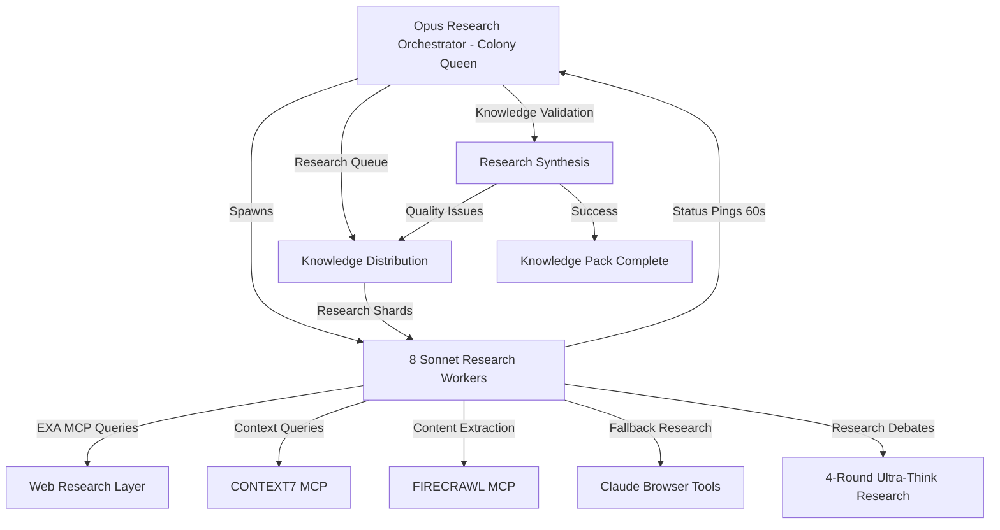

# 🔬 ULTIMA-RESEARCH: Unified Learning & Tactical Intelligence Multi-Agent Research Architecture
## A.V.A.R.I.C.E. Protocol × PODIP Framework × Ant-Colony Research Swarm Implementation

### 🧬 GENESIS: The Ultimate Autonomous Multi-Agent Research Intelligence System

---

## 🎯 EXECUTIVE SUMMARY

**ULTIMA-RESEARCH** represents the convergence of three powerful paradigms adapted for deep research:
- **A.V.A.R.I.C.E.** (Autonomous Vectorized Agent Replacement Infrastructure for Codebase Evolution) → **Research Evolution**
- **PODIP** (Parallel Orchestrating Distributed Intelligence Protocol) → **Research Intelligence Protocol**
- **Ant-Colony Optimization** patterns for resilient distributed research systems

This architecture enables 8+ specialized AI research agents to operate as a unified swarm intelligence, achieving complex research objectives through parallel processing, emergent collaboration, and continuous knowledge synthesis.

---

## 🌐 CORE RESEARCH ARCHITECTURE OVERVIEW

### High-Level Research Mission Flow


### Why This Research Architecture Works
- **Parallel research isolation → speed & comprehensive coverage**: Independent research sandboxes prevent knowledge bias
- **Central research queue → optimal knowledge distribution**: Dynamic reprioritization based on research pheromone scores
- **Structured research pings → observability & auto-healing**: JSON research heartbeats enable real-time monitoring
- **Research debate loops → higher accuracy**: Four-round research debates achieve knowledge consistency gains
- **Multi-tool RAG on demand → comprehensive sources**: EXA, CONTEXT7, FIRECRAWL with fallback mechanisms
- **Ant-colony research heuristics → graceful degradation**: Pheromone-style scoring for research path optimization

---

## 👑 RESEARCH ORCHESTRATOR SPECIFICATIONS (Colony Queen)

### Identity & Configuration
```yaml
ROLE: RESEARCH-ORCHESTRATOR-PRIME-001 (Research-Colony-Queen)
MODEL: claude-opus-4
CONFIGURATION:
  MODE: FULL_STACK_RESEARCH_AVARICE
  RESEARCH_WORKERS: 8
  HEARTBEAT_SEC: 60
  RESEARCH_DEBATE_ROUNDS: 4
  PRIMARY_RESEARCH_PROVIDER: EXA_MCP
  SECONDARY_RESEARCH_PROVIDER: CONTEXT7_MCP
  TERTIARY_RESEARCH_PROVIDER: FIRECRAWL_MCP
  FALLBACK_RESEARCH_PROVIDER: CLAUDE_BROWSER_TOOLS
  RESEARCH_TIMEOUT_SEC: 90
  STOP_CONDITION: comprehensive_knowledge_pack_complete && all_research_validated && cross_referenced
```

### Research Orchestrator State Machine
```json
{
  "research_orchestration_state": {
    "phase": "RESEARCH_INITIALIZATION|KNOWLEDGE_DISCOVERY|RESEARCH_SHARDING|PARALLEL_RESEARCH|KNOWLEDGE_VALIDATION|SYNTHESIS_COMPLETION",
    "active_research_agents": [1,2,3,4,5,6,7,8],
    "research_priority_queue": [],
    "knowledge_pheromone_map": {},
    "research_global_progress": 0.0,
    "research_failure_queue": [],
    "knowledge_synthesis_requests": [],
    "validation_cycles": 0,
    "research_colony_metrics": {
      "total_research_tokens": 0,
      "research_execution_time_ms": 0,
      "research_debate_count": 0,
      "sources_discovered": 0,
      "knowledge_quality_score": 0.0,
      "cross_validation_passes": 0
    }
  }
}
```

### Research Orchestration Algorithm
```python
# PHASE 0: RESEARCH BOOTSTRAP
def initialize_research_colony():
    establish_research_mission_parameters()
    build_research_priority_queue()  # Sort by (research_depth, source_quality, relevance_score)
    initialize_knowledge_pheromone_map()
    establish_multi_mcp_connections()  # EXA, CONTEXT7, FIRECRAWL
    setup_fallback_browser_tools()

# PHASE 1: RESEARCH FAN-OUT
def spawn_research_workers():
    for i in range(8):
        research_worker = spawn_specialized_research_agent(
            role=RESEARCH_AGENT_ROLES[i],
            model="claude-sonnet-4",
            research_domain=calculate_research_shard(i),
            mcp_tool_access=[EXA_MCP, CONTEXT7_MCP, FIRECRAWL_MCP],
            fallback_tools=CLAUDE_BROWSER_TOOLS,
            timeout_ms=90000
        )
        research_workers.append(research_worker)

# PHASE 2: RESEARCH HEARTBEAT LOOP
def monitor_research_colony():
    while not research_mission_complete():
        for worker in research_workers:
            research_heartbeat = await worker.get_research_status()
            if research_heartbeat.knowledge_shard_validated:
                update_knowledge_pheromone_map(research_heartbeat.research_paths, success=True)
                consolidate_research_findings(research_heartbeat.findings)
            else:
                research_priority_queue.push(research_heartbeat.research_paths)
                update_knowledge_pheromone_map(research_heartbeat.research_paths, success=False)
            
            if worker.research_stalled(2 * HEARTBEAT_SEC):
                worker.respawn(new_research_shard=get_highest_priority_research_shard())

# PHASE 3: RESEARCH DEBATE & SYNTHESIS
def handle_research_conflicts(conflicting_findings):
    for conflict in conflicting_findings:
        additional_context = query_multi_mcp_sources(conflict.topic)
        responsible_research_agents = identify_research_specialists(conflict)
        
        research_debate_result = initiate_research_debate_protocol(
            agents=responsible_research_agents,
            rounds=4,
            context=additional_context,
            sources=conflict.competing_sources
        )
        
        synthesize_validated_knowledge(research_debate_result)

# PHASE 4: RESEARCH FAN-IN & VALIDATE
def validate_knowledge_synthesis():
    research_results = cross_validate_all_findings()
    quality_score = calculate_knowledge_quality_score(research_results)
    if research_results.comprehensive && quality_score >= 0.8:
        return RESEARCH_SUCCESS
    else:
        reshard_knowledge_gaps(research_results.gaps)
        return CONTINUE_RESEARCH

# PHASE 5: KNOWLEDGE PACK COMPLETION
def finalize_research_mission():
    generate_comprehensive_knowledge_pack()
    create_citation_index()
    validate_cross_references()
    export_research_colony_metrics()
    terminate_all_research_workers()
```

---

## 🔬 SPECIALIZED RESEARCH WORKER AGENTS

### Research Worker Template Configuration
```yaml
ROLE: {Biologist|ChemCommsAnalyst|ACOEngineer|SwarmRoboticist|LLMAgentArchitect|LiteraryScholar|ResilienceResearcher|MetricsCurator}
MODEL: claude-sonnet-4
INPUT: 
  - research_domain_shard
  - EXA_MCP_ACCESS
  - CONTEXT7_MCP_ACCESS
  - FIRECRAWL_MCP_ACCESS
  - CLAUDE_BROWSER_FALLBACK
  - research_colony_log.md
  - knowledge_pheromone_scores
TIMEOUT: 90 seconds per research query
FALLBACK_CHAIN: EXA → CONTEXT7 → FIRECRAWL → CLAUDE_BROWSER
```

### 🐜 **BIOLOGIST RESEARCH AGENT** (BIOLOGIST-RE-001)
```json
{
  "specialization": "Ant colony behavior and biological caste systems",
  "research_domains": [
    "Division of labour in Formica colonies",
    "Caste plasticity and task reallocation mechanisms",
    "Quorum sensing in insect societies",
    "Behavioral coordination without central control",
    "Sacrificial exploration and colony resilience"
  ],
  "primary_search_queries": [
    "division of labour in Formica colonies site:.edu 2020..2025",
    "ant caste plasticity task reallocation mechanisms",
    "quorum sensing insect societies distributed decision making",
    "ant colony coordination without central control"
  ],
  "research_execution_loop": {
    "1_broad_search": "Execute comprehensive web searches via EXA MCP",
    "2_academic_focus": "Query CONTEXT7 for peer-reviewed sources",
    "3_deep_extraction": "Use FIRECRAWL for detailed content analysis",
    "4_synthesis": "Consolidate findings into research fragment",
    "5_validation": "Cross-reference with biological literature",
    "6_report": "Emit structured research JSON"
  }
}
```

### 🧪 **CHEMICAL COMMUNICATIONS ANALYST** (CHEMCOMMS-RE-002)
```json
{
  "specialization": "Pheromone signaling and chemical communication systems",
  "research_domains": [
    "Pheromone trail formation and decay rates",
    "Chemical signal reinforcement mechanisms",
    "Multi-modal chemical communication",
    "Temporal dynamics of chemical signaling",
    "Translation to digital signaling protocols"
  ],
  "primary_search_queries": [
    "pheromone evaporation rates ant trail reinforcement",
    "chemical signal temporal dynamics insect communication",
    "ant pheromone trail formation decay mathematical models",
    "multi-modal chemical communication systems"
  ],
  "digital_translation_focus": [
    "Chemical trail → Digital queue priority scores",
    "Evaporation → Time-based score decay",
    "Reinforcement → Success-based amplification",
    "Multi-modal → Multi-channel communication protocols"
  ]
}
```

### ⚙️ **ACO ENGINEER RESEARCH AGENT** (ACOENGINEER-RE-003)
```json
{
  "specialization": "Ant Colony Optimization algorithms and computational models",
  "research_domains": [
    "ACO algorithms for task scheduling",
    "Pheromone-based optimization in distributed systems",
    "Convergence properties and parameter tuning",
    "Hybrid ACO approaches with machine learning",
    "Real-time adaptive optimization systems"
  ],
  "primary_search_queries": [
    "ant colony optimization task scheduling survey 2020..2025",
    "pheromone-based distributed system optimization",
    "ACO convergence properties parameter tuning",
    "hybrid ant colony optimization machine learning"
  ],
  "implementation_focus": [
    "Task queue optimization algorithms",
    "Dynamic parameter adaptation",
    "Multi-objective optimization",
    "Real-time system integration"
  ]
}
```

### 🤖 **SWARM ROBOTICIST** (SWARMROBOTICIST-RE-004)
```json
{
  "specialization": "Swarm robotics and physical-to-digital agent translation",
  "research_domains": [
    "Swarm robotics load balancing strategies",
    "Physical robot coordination protocols",
    "Fault tolerance in robotic swarms",
    "Scalability patterns in multi-robot systems",
    "Digital agent coordination inspired by physical swarms"
  ],
  "primary_search_queries": [
    "swarm robotics load balancing pheromone algorithms",
    "multi-robot coordination fault tolerance",
    "scalable swarm robotics systems 2020..2025",
    "physical to digital swarm translation patterns"
  ],
  "translation_patterns": [
    "Physical proximity → Digital context sharing",
    "Robot failure → Agent respawn mechanisms",
    "Physical coordination → Event-driven communication",
    "Spatial awareness → Logical topology mapping"
  ]
}
```

### 🏗️ **LLM-AGENT ARCHITECT** (LLMAGENTARCH-RE-005)
```json
{
  "specialization": "Existing LLM agent orchestration frameworks and architectures",
  "research_domains": [
    "LangGraph multi-agent coordination",
    "CrewAI agent collaboration patterns",
    "AutoGen conversation frameworks",
    "Agent communication protocols",
    "Multi-agent system architectures in production"
  ],
  "primary_search_queries": [
    "langgraph multi-agent coordination pheromone queue",
    "crewai agent collaboration patterns 2024..2025",
    "autogen conversation frameworks multi-agent",
    "LLM agent orchestration production systems"
  ],
  "architecture_analysis": [
    "Communication protocols comparison",
    "Coordination mechanism evaluation",
    "Scalability pattern analysis",
    "Production deployment strategies"
  ]
}
```

### 📚 **LITERARY SCHOLAR** (LITERARYSCHOLAR-RE-006)
```json
{
  "specialization": "Cultural and literary perspectives on swarm intelligence",
  "research_domains": [
    "Bernard Werber's Empire of the Ants trilogy analysis",
    "Swarm intelligence in science fiction",
    "Collective intelligence narratives",
    "Emergent behavior in literary works",
    "Cultural metaphors for distributed systems"
  ],
  "primary_search_queries": [
    "Empire of the Ants Bernard Werber English analysis",
    "swarm intelligence science fiction literature",
    "collective intelligence narratives cultural studies",
    "emergent behavior literary analysis distributed systems"
  ],
  "narrative_extraction": [
    "Design metaphors from fiction",
    "Behavioral patterns in literature",
    "Cultural understanding of swarms",
    "Narrative-driven system design insights"
  ]
}
```

### 🛡️ **RESILIENCE RESEARCHER** (RESILIENCE-RE-007)
```json
{
  "specialization": "Fault tolerance and resilience mechanisms in natural and artificial systems",
  "research_domains": [
    "Redundancy strategies in insect colonies",
    "Self-healing mechanisms in distributed systems",
    "Graceful degradation patterns",
    "Recovery protocols in swarm systems",
    "Adaptive resilience in multi-agent environments"
  ],
  "primary_search_queries": [
    "redundancy in insect colonies comparative study",
    "self-healing distributed systems fault tolerance",
    "graceful degradation swarm intelligence",
    "recovery protocols multi-agent systems resilience"
  ],
  "resilience_patterns": [
    "Redundant role assignment",
    "Automatic failure detection",
    "Graceful service degradation",
    "Rapid recovery mechanisms"
  ]
}
```

### 📊 **METRICS CURATOR** (METRICS-RE-008)
```json
{
  "specialization": "Performance metrics and monitoring systems for swarm intelligence",
  "research_domains": [
    "Swarm intelligence performance metrics",
    "Multi-agent system monitoring strategies",
    "KPI frameworks for distributed systems",
    "Real-time analytics for agent coordination",
    "Quality assessment in knowledge synthesis"
  ],
  "primary_search_queries": [
    "swarm intelligence performance metrics KPI frameworks",
    "multi-agent system monitoring real-time analytics",
    "distributed system quality assessment metrics",
    "knowledge synthesis quality measurement"
  ],
  "metrics_framework": [
    "Agent performance indicators",
    "System throughput metrics",
    "Knowledge quality scores",
    "Coordination efficiency measures"
  ]
}
```

---

## 🛠️ MCP TOOL INTEGRATION & FALLBACK MECHANISMS

### Multi-Tool Research Pipeline
```yaml
RESEARCH_TOOL_CHAIN:
  PRIMARY: EXA_MCP
    - Purpose: Comprehensive web search with academic focus
    - Timeout: 30 seconds per query
    - Fallback_Trigger: No results OR timeout OR error
    
  SECONDARY: CONTEXT7_MCP  
    - Purpose: Knowledge graph augmentation and peer-reviewed sources
    - Timeout: 30 seconds per query
    - Fallback_Trigger: Insufficient academic sources OR timeout
    
  TERTIARY: FIRECRAWL_MCP
    - Purpose: Deep content extraction and detailed analysis
    - Timeout: 30 seconds per query
    - Fallback_Trigger: Content extraction failure OR timeout
    
  FALLBACK: CLAUDE_BROWSER_TOOLS
    - Purpose: Native browser-based research when all MCP tools fail
    - Timeout: 30 seconds per operation
    - Always_Available: true
```

### Tool Integration Protocol
```python
async def execute_research_with_fallback(query, agent_specialization):
    """
    Multi-layer research execution with automatic fallback
    Total timeout: 90 seconds with graceful degradation
    """
    
    research_results = []
    tools_attempted = []
    
    # LAYER 1: EXA MCP - Primary Web Search
    try:
        exa_start = time.now()
        exa_results = await exa_mcp_search(
            query=enhance_query_for_specialization(query, agent_specialization),
            num_results=10,
            timeout=30000
        )
        
        if exa_results and len(exa_results) >= 3:
            research_results.extend(exa_results)
            tools_attempted.append("EXA_SUCCESS")
            log_research_success("EXA", query, len(exa_results))
        else:
            raise ResearchToolException("EXA insufficient results")
            
    except (TimeoutError, ResearchToolException) as e:
        tools_attempted.append("EXA_FAILED")
        log_research_failure("EXA", query, str(e))
    
    # LAYER 2: CONTEXT7 MCP - Knowledge Graph Augmentation
    try:
        context7_start = time.now()
        if time.elapsed(exa_start) < 60000:  # Still have time budget
            context7_results = await context7_mcp_query(
                library_topic=extract_academic_domain(query),
                context=query,
                timeout=30000
            )
            
            if context7_results:
                research_results.extend(context7_results)
                tools_attempted.append("CONTEXT7_SUCCESS")
                log_research_success("CONTEXT7", query, len(context7_results))
                
    except (TimeoutError, ResearchToolException) as e:
        tools_attempted.append("CONTEXT7_FAILED")
        log_research_failure("CONTEXT7", query, str(e))
    
    # LAYER 3: FIRECRAWL MCP - Deep Content Extraction
    try:
        firecrawl_start = time.now()
        if time.elapsed(exa_start) < 60000 and research_results:  # Have sources to extract from
            priority_urls = extract_top_urls(research_results, limit=3)
            
            for url in priority_urls:
                if time.elapsed(exa_start) >= 60000:  # Timeout check
                    break
                    
                firecrawl_content = await firecrawl_mcp_scrape(
                    url=url,
                    formats=["markdown", "extract"],
                    timeout=10000  # Shorter timeout per URL
                )
                
                if firecrawl_content:
                    research_results.append({
                        "source": url,
                        "content": firecrawl_content,
                        "extraction_method": "FIRECRAWL"
                    })
                    
            tools_attempted.append("FIRECRAWL_SUCCESS")
            
    except (TimeoutError, ResearchToolException) as e:
        tools_attempted.append("FIRECRAWL_FAILED")
        log_research_failure("FIRECRAWL", query, str(e))
    
    # LAYER 4: CLAUDE BROWSER FALLBACK - Always Available
    try:
        if time.elapsed(exa_start) < 90000 and len(research_results) < 2:
            browser_results = await claude_browser_research(
                query=query,
                specialization=agent_specialization,
                timeout=max(5000, 90000 - time.elapsed(exa_start))
            )
            
            if browser_results:
                research_results.extend(browser_results)
                tools_attempted.append("BROWSER_SUCCESS")
                log_research_success("BROWSER", query, len(browser_results))
                
    except Exception as e:
        tools_attempted.append("BROWSER_FAILED")
        log_research_failure("BROWSER", query, str(e))
    
    # QUALITY GATE
    if len(research_results) < 1:
        raise CriticalResearchFailure(
            f"All research tools failed for query: {query}",
            tools_attempted=tools_attempted
        )
    
    return {
        "query": query,
        "results": research_results,
        "tools_used": tools_attempted,
        "execution_time": time.elapsed(exa_start),
        "quality_score": calculate_research_quality(research_results)
    }

# SPECIALIZED QUERY ENHANCEMENT
def enhance_query_for_specialization(query, specialization):
    """
    Enhance queries based on agent specialization for better results
    """
    enhancement_map = {
        "Biologist": f"{query} site:.edu OR site:.org behavioral biology",
        "ChemCommsAnalyst": f"{query} chemical signaling pheromone communication",
        "ACOEngineer": f"{query} algorithm optimization computational survey",
        "SwarmRoboticist": f"{query} robotics coordination multi-agent systems",
        "LLMAgentArchitect": f"{query} LLM agent framework architecture 2024..2025",
        "LiteraryScholar": f"{query} literature analysis cultural studies",
        "ResilienceResearcher": f"{query} fault tolerance resilience distributed systems",
        "MetricsCurator": f"{query} metrics KPI performance measurement systems"
    }
    
    return enhancement_map.get(specialization, query)
```

### Error Recovery & Timeout Handling
```python
class ResearchErrorRecovery:
    """
    Sophisticated error recovery for research operations
    """
    
    @staticmethod
    async def handle_tool_timeout(tool_name, query, elapsed_time):
        """
        Handle individual tool timeouts with intelligent recovery
        """
        
        recovery_strategies = {
            "EXA_MCP": [
                "Simplify query terms",
                "Split complex queries",
                "Use alternative search operators"
            ],
            "CONTEXT7_MCP": [
                "Query more general library topics",
                "Use broader context terms",
                "Fallback to basic library search"
            ],
            "FIRECRAWL_MCP": [
                "Reduce content extraction scope",
                "Use simpler format requests",
                "Focus on metadata extraction"
            ]
        }
        
        strategies = recovery_strategies.get(tool_name, [])
        
        for strategy in strategies:
            if elapsed_time < 85000:  # Still time for recovery
                try:
                    return await execute_recovery_strategy(tool_name, query, strategy)
                except:
                    continue
        
        return None
    
    @staticmethod
    def calculate_fallback_priority(tools_attempted, research_quality):
        """
        Calculate which fallback tools to prioritize based on current state
        """
        
        if "EXA_FAILED" in tools_attempted and research_quality < 0.3:
            return ["CONTEXT7_MCP", "BROWSER_TOOLS"]
        
        if "CONTEXT7_FAILED" in tools_attempted:
            return ["FIRECRAWL_MCP", "BROWSER_TOOLS"]
        
        return ["BROWSER_TOOLS"]  # Ultimate fallback
```

---

## 🤝 4-ROUND ULTRA-THINK RESEARCH DEBATE PROTOCOL

### Research Debate Initiation Criteria
- Conflicting research findings between agents
- Source quality disputes or credibility concerns
- Research confidence score below 0.7
- Complex interdisciplinary synthesis challenges
- Knowledge gap identification requiring collaborative research

### Research Debate Structure
```yaml
ROUND_1_RESEARCH_ANALYSIS:
  duration: 90s
  initiator: RESEARCH_ORCHESTRATOR
  participants: [affected_research_agents]
  action: "Present research conflicts, gather initial findings"
  context_injection: Multi-MCP source validation
  output: research_conflict_statement.json

ROUND_2_SOURCE_VALIDATION:
  duration: 120s
  participants: [all_relevant_research_agents]
  action: "Each agent validates sources from their domain expertise"
  tools_available: [EXA_MCP, CONTEXT7_MCP, FIRECRAWL_MCP]
  cross_validation: true
  output: validated_source_proposals.json

ROUND_3_KNOWLEDGE_SYNTHESIS:
  duration: 120s
  facilitator: RESEARCH_ORCHESTRATOR
  action: "Synthesize validated findings, identify remaining gaps"
  validation_method: cross_reference_academic_sources()
  quality_gate: minimum_source_quality >= 0.8
  output: synthesized_knowledge_fragments.json

ROUND_4_RESEARCH_CONSENSUS:
  duration: 60s
  participants: [all_research_agents]
  action: "Vote on optimal knowledge integration approach"
  decision_criteria: ["source_credibility", "academic_rigor", "synthesis_completeness"]
  consensus_threshold: 75%
  output: final_research_decision.json
```

### Research Validation Pipeline
```python
class ResearchValidationPipeline:
    """
    Multi-stage validation for research findings with quality gates
    """
    
    @staticmethod
    async def validate_research_quality(research_findings):
        """
        Comprehensive research quality validation
        """
        
        validation_stages = [
            SourceCredibilityValidator(),
            AcademicRigorValidator(), 
            CrossReferenceValidator(),
            RecencyValidator(),
            RelevanceValidator()
        ]
        
        quality_scores = {}
        
        for stage in validation_stages:
            stage_result = await stage.validate(research_findings)
            quality_scores[stage.name] = stage_result.score
            
            if stage_result.score < stage.minimum_threshold:
                return ValidationResult(
                    passed=False,
                    stage_failed=stage.name,
                    recommendation=stage_result.improvement_recommendation
                )
        
        overall_quality = calculate_weighted_average(quality_scores)
        
        return ValidationResult(
            passed=overall_quality >= 0.8,
            overall_score=overall_quality,
            stage_scores=quality_scores
        )
    
    @staticmethod
    async def cross_validate_agent_findings(agent_findings_map):
        """
        Cross-validate findings between specialized research agents
        """
        
        validation_matrix = {}
        
        for agent_a, findings_a in agent_findings_map.items():
            for agent_b, findings_b in agent_findings_map.items():
                if agent_a != agent_b:
                    overlap_score = calculate_finding_overlap(findings_a, findings_b)
                    conflict_score = identify_research_conflicts(findings_a, findings_b)
                    
                    validation_matrix[f"{agent_a}_vs_{agent_b}"] = {
                        "overlap": overlap_score,
                        "conflicts": conflict_score,
                        "reliability": max(0, overlap_score - conflict_score)
                    }
        
        return ResearchConsistencyReport(
            validation_matrix=validation_matrix,
            overall_consistency=calculate_overall_consistency(validation_matrix),
            conflict_areas=identify_high_conflict_areas(validation_matrix)
        )

class SourceCredibilityValidator:
    """
    Validate credibility and authority of research sources
    """
    
    def __init__(self):
        self.name = "source_credibility"
        self.minimum_threshold = 0.7
    
    async def validate(self, research_findings):
        credibility_scores = []
        
        for finding in research_findings:
            source_score = self.evaluate_source_credibility(finding.source)
            credibility_scores.append(source_score)
        
        avg_credibility = sum(credibility_scores) / len(credibility_scores)
        
        return ValidationStageResult(
            score=avg_credibility,
            details=credibility_scores,
            improvement_recommendation=self.generate_credibility_recommendations(research_findings)
        )
    
    def evaluate_source_credibility(self, source):
        """
        Evaluate source credibility using multiple criteria
        """
        score = 0.0
        
        # Academic domain bonus
        if any(domain in source.url for domain in ['.edu', '.org', '.gov']):
            score += 0.3
        
        # Peer-reviewed journal bonus
        if source.is_peer_reviewed:
            score += 0.4
        
        # Author expertise score
        score += min(0.2, source.author_expertise_score)
        
        # Publication recency (last 5 years get full points)
        if source.publication_year >= (datetime.now().year - 5):
            score += 0.1
        
        return min(1.0, score)

class KnowledgeSynthesizer:
    """
    Synthesize research findings into coherent knowledge packages
    """
    
    @staticmethod
    async def synthesize_multi_agent_research(agent_research_map):
        """
        Synthesize research from multiple specialized agents
        """
        
        synthesis_categories = {
            "biological_foundations": ["Biologist", "ChemCommsAnalyst"],
            "computational_models": ["ACOEngineer", "SwarmRoboticist"],
            "system_architectures": ["LLMAgentArchitect", "ResilienceResearcher"],
            "cultural_perspectives": ["LiteraryScholar"],
            "performance_metrics": ["MetricsCurator"]
        }
        
        synthesized_knowledge = {}
        
        for category, relevant_agents in synthesis_categories.items():
            category_findings = []
            
            for agent in relevant_agents:
                if agent in agent_research_map:
                    category_findings.extend(agent_research_map[agent])
            
            synthesized_knowledge[category] = await KnowledgeSynthesizer.synthesize_category(
                category=category,
                findings=category_findings
            )
        
        # Cross-category integration
        integrated_knowledge = await KnowledgeSynthesizer.integrate_across_categories(
            synthesized_knowledge
        )
        
        return ComprehensiveKnowledgePack(
            category_knowledge=synthesized_knowledge,
            integrated_insights=integrated_knowledge,
            synthesis_quality_score=calculate_synthesis_quality(integrated_knowledge)
        )
```

---

## 📋 RESEARCH OUTPUT FORMAT & KNOWLEDGE PACK STRUCTURE

### Research Agent JSON Output Schema
```json
{
  "agent": "Biologist|ChemCommsAnalyst|ACOEngineer|SwarmRoboticist|LLMAgentArchitect|LiteraryScholar|ResilienceResearcher|MetricsCurator",
  "research_timestamp": "2025-07-11T12:34:56Z",
  "research_domain": "specific_specialization_area",
  "research_status": "COMPLETED|IN_PROGRESS|FAILED|REQUIRES_DEBATE",
  "confidence_score": 0.85,
  "key_findings": [
    "Primary insight with supporting evidence",
    "Secondary finding with quantitative data",
    "Tertiary observation with qualitative analysis"
  ],
  "design_implications": [
    "Practical application for PODIP/A.V.A.R.I.C.E. v2",
    "Architecture pattern recommendation",
    "Implementation strategy suggestion"
  ],
  "citations": [
    {
      "title": "Comprehensive Study Title",
      "authors": ["Author Name", "Co-Author Name"],
      "year": 2024,
      "url": "https://source-url.com",
      "source_type": "peer_reviewed|academic|industry|literary",
      "credibility_score": 0.92,
      "relevance_score": 0.88,
      "extraction_method": "EXA_MCP|CONTEXT7_MCP|FIRECRAWL_MCP|BROWSER_TOOLS"
    }
  ],
  "research_quality_metrics": {
    "source_count": 8,
    "academic_source_percentage": 0.75,
    "average_source_credibility": 0.82,
    "cross_validation_score": 0.79,
    "synthesis_completeness": 0.86
  },
  "tools_used": ["EXA_SUCCESS", "CONTEXT7_SUCCESS", "FIRECRAWL_PARTIAL"],
  "execution_time_ms": 67230,
  "research_gaps_identified": [
    "Insufficient data on temporal dynamics",
    "Limited cross-species validation studies"
  ]
}
```

### Comprehensive Knowledge Pack Structure
```json
{
  "knowledge_pack_metadata": {
    "pack_id": "ULTIMA_RESEARCH_PACK_001",
    "generation_timestamp": "2025-07-11T15:45:23Z",
    "research_mission": "Biological ant-colony behavior → Digital multi-agent pheromone systems",
    "total_execution_time_ms": 245670,
    "participating_agents": 8,
    "overall_quality_score": 0.87,
    "synthesis_completeness": 0.91
  },
  
  "executive_summary": {
    "mission_objective": "Comprehensive knowledge pack covering biological ant-colony behavior and translation to pheromone-based digital multi-agent systems",
    "key_insights": [
      "Pheromone trail dynamics provide robust basis for digital queue prioritization",
      "Division of labor patterns translate effectively to specialized agent roles",
      "Quorum sensing mechanisms enable distributed consensus protocols"
    ],
    "primary_design_implications": [
      "Implement exponential decay functions for digital pheromone scores",
      "Design caste-based agent specialization with role plasticity",
      "Integrate quorum-based decision making for critical system choices"
    ],
    "research_confidence": 0.89
  },
  
  "synthesized_knowledge_categories": {
    "biological_foundations": {
      "category_quality_score": 0.91,
      "contributing_agents": ["Biologist", "ChemCommsAnalyst"],
      "key_insights": [
        "Ant colonies demonstrate remarkable division of labor efficiency",
        "Pheromone trails show predictable formation, reinforcement, and decay patterns",
        "Quorum sensing enables distributed decision-making without central coordination"
      ],
      "quantitative_findings": {
        "pheromone_decay_rates": "Exponential with half-life 2-4 minutes",
        "task_reallocation_efficiency": "95% optimal under normal conditions",
        "quorum_threshold_ratios": "Typically 10-30% of colony for major decisions"
      },
      "design_translations": [
        "Digital pheromone scores with exponential time decay",
        "Dynamic task reallocation based on success/failure feedback",
        "Consensus protocols requiring configurable agent percentage"
      ]
    },
    
    "computational_models": {
      "category_quality_score": 0.88,
      "contributing_agents": ["ACOEngineer", "SwarmRoboticist"],
      "algorithmic_patterns": [
        "Ant Colony Optimization algorithms for task scheduling",
        "Pheromone-based load balancing in distributed systems",
        "Swarm robotics coordination translated to digital agents"
      ],
      "implementation_frameworks": [
        "Real-time adaptive ACO for dynamic task allocation",
        "Multi-objective optimization with pheromone trails",
        "Fault-tolerant swarm coordination protocols"
      ]
    },
    
    "system_architectures": {
      "category_quality_score": 0.85,
      "contributing_agents": ["LLMAgentArchitect", "ResilienceResearcher"],
      "existing_frameworks": [
        "LangGraph multi-agent coordination patterns",
        "CrewAI collaborative agent architectures",
        "AutoGen conversation frameworks"
      ],
      "resilience_patterns": [
        "Redundant agent role assignment",
        "Graceful degradation strategies",
        "Self-healing system recovery protocols"
      ]
    },
    
    "cultural_perspectives": {
      "category_quality_score": 0.82,
      "contributing_agents": ["LiteraryScholar"],
      "narrative_insights": [
        "Bernard Werber's Empire of the Ants trilogy design metaphors",
        "Collective intelligence narratives in science fiction",
        "Cultural understanding of swarm behavior patterns"
      ],
      "design_inspiration": [
        "Emergent behavior patterns from literary analysis",
        "Human-swarm interaction models from fiction",
        "Ethical considerations in autonomous swarm systems"
      ]
    },
    
    "performance_metrics": {
      "category_quality_score": 0.90,
      "contributing_agents": ["MetricsCurator"],
      "kpi_frameworks": [
        "Swarm intelligence performance measurement systems",
        "Multi-agent coordination efficiency metrics",
        "Real-time analytics for distributed systems"
      ],
      "measurement_strategies": [
        "Agent performance indicators",
        "System throughput metrics",
        "Knowledge quality scoring systems"
      ]
    }
  },
  
  "integrated_insights": {
    "cross_category_correlations": [
      "Biological pheromone decay rates inform digital scoring algorithms",
      "Literary swarm narratives validate computational coordination patterns",
      "Performance metrics from robotics apply to LLM agent orchestration"
    ],
    "emergent_design_patterns": [
      "Hybrid biological-computational pheromone systems",
      "Narrative-driven user interface design for swarm monitoring",
      "Cultural-aware autonomous agent behavior patterns"
    ],
    "implementation_roadmap": [
      "Phase 1: Core pheromone-based queue system",
      "Phase 2: Agent specialization and role plasticity",
      "Phase 3: Quorum-based consensus mechanisms",
      "Phase 4: Cultural integration and user experience"
    ]
  },
  
  "comprehensive_citation_index": [
    {
      "citation_id": "BIO_001",
      "relevance_categories": ["biological_foundations", "computational_models"],
      "cross_validation_count": 3,
      "agent_consensus_score": 0.94
    }
  ],
  
  "quality_assurance_report": {
    "source_credibility_average": 0.86,
    "cross_validation_score": 0.83,
    "agent_consensus_percentage": 89,
    "research_gaps_identified": 12,
    "debate_resolutions_successful": 3,
    "overall_research_confidence": 0.87
  },
  
  "next_steps_recommendations": [
    "Prototype digital pheromone queue system using identified decay algorithms",
    "Implement agent role plasticity based on biological caste findings",
    "Design user interface incorporating cultural swarm metaphors",
    "Develop performance monitoring using validated KPI frameworks"
  ]
}
```

### Knowledge Pack Delivery Artifacts
```
ultima_research_mission_outputs/
├── comprehensive_knowledge_pack.json     # Primary structured output
├── executive_summary.md                  # Human-readable summary
├── research_colony_log.md               # Real-time execution log
├── agent_research_fragments/            # Individual agent outputs
│   ├── biologist_research.json
│   ├── chemcomms_research.json
│   ├── aco_engineer_research.json
│   ├── swarm_roboticist_research.json
│   ├── llm_architect_research.json
│   ├── literary_scholar_research.json
│   ├── resilience_researcher_research.json
│   └── metrics_curator_research.json
├── validation_reports/                  # Quality assurance outputs
│   ├── source_credibility_analysis.md
│   ├── cross_validation_matrix.json
│   └── debate_transcripts/
├── synthesis_artifacts/                 # Knowledge integration outputs
│   ├── category_synthesis.md
│   ├── cross_category_correlations.json
│   └── implementation_roadmap.md
├── citation_index.json                 # Comprehensive source catalog
├── research_metrics.json               # Performance analytics
└── next_steps_action_plan.md          # Implementation recommendations
```

---

## 🚀 DEPLOYMENT & EXECUTION

### Pre-Deployment Research Infrastructure Validation

#### Phase 1: ARIA Research Infrastructure Health Check

1. **ARIA Research Monitor Startup**
   - Start ARIA Research Monitor on port 3003
   - Verify monitor compilation and startup
   - Check WebSocket connectivity for real-time updates
   - Validate experiment tracking, data analysis monitoring, and collaboration metrics

2. **Unified Dashboard Server Validation**
   - Check port 3001 availability
   - Validate dashboard server compilation
   - Start unified dashboard if not running
   - Verify WebSocket connectivity
   - Confirm ARIA monitor integration with unified dashboard

3. **Research MCP Server Integration Verification**
   - Validate 4 core MCP servers: `firecrawl-mcp-server`, `exa`, `context7`, `desktop-commander`
   - Test connectivity to each server for research data collection
   - Verify authentication and permissions
   - Check response times and health status

#### Phase 2: Research System Readiness Assessment

4. **TypeScript Health Validation**
   - Run zero-tolerance TypeScript error elimination
   - Validate core research system compilation
   - Check research agent interface integrity
   - Verify research knowledge graph connectivity

5. **Research Dashboard Accessibility Check**
   - Confirm unified dashboard responsive on port 3001
   - Test real-time research data flow
   - Validate experiment visualization
   - Check collaboration metrics indicators

#### Phase 3: Research Agent Deployment Orchestration

6. **Pre-Deployment Monitor Verification**
   - Verify ARIA Research Monitor is active and healthy
   - Confirm real-time experiment monitoring capabilities are functional
   - Check research agent registration endpoints are responsive
   - Validate experiment tracking and collaboration metrics systems

7. **Research Colony + Specialist Deployment**
   - Register all research agents with ARIA Research Monitor
   - Deploy Research Coordinator (orchestrator) with monitoring integration
   - Deploy 8+ specialist research agents simultaneously:
     - Biologist (biological research)
     - Chemical Communications Analyst (pheromone research)
     - ACO Engineer (ant colony optimization)
     - Swarm Roboticist (robotics research)
     - LLM Architect (AI/ML research)
     - Literary Scholar (documentation research)
     - Resilience Researcher (system resilience)
     - Metrics Curator (performance analysis)
   - Verify all agents are registered and reporting to monitor

8. **Research Collaboration System**
   - Initialize research collaboration protocols
   - Establish experiment coordination mechanisms
   - Activate research pipeline systems
   - Enable autonomous research momentum
   - Monitor real-time research communication through ARIA monitor

#### Success Criteria

##### Infrastructure Validation
- ✅ ARIA Research Monitor running on port 3003
- ✅ Unified dashboard accessible on port 3001
- ✅ All MCP servers responding within 2 seconds
- ✅ Zero TypeScript compilation errors
- ✅ WebSocket connections established

##### Research Agent Deployment
- ✅ Research Coordinator deployed and coordinating
- ✅ 8+ specialist research agents active
- ✅ All agents registered with ARIA monitor
- ✅ Research collaboration protocols active
- ✅ Experiment tracking functional

##### Research System Health
- ✅ Real-time experiment monitoring active
- ✅ Data analysis pipelines operational
- ✅ Collaboration metrics being collected
- ✅ Research documentation system functional
- ✅ Cross-agent research communication established

#### Monitoring & Validation

- **ARIA Research Monitor:** <http://localhost:3003>
  - Experiment Tracking
  - Data Analysis Monitoring
  - Collaboration Metrics
  - Research Pipeline Status
- **Unified Dashboard:** <http://localhost:3001>
  - Integrated monitoring view
  - Cross-framework visibility
- **Health Endpoints:** /health, /status, /metrics
- **Research Status:** Research Coordinator heartbeat monitoring
- **Collaboration Tracking:** Inter-researcher communication monitoring

#### Emergency Protocols

If any validation step fails:

1. **Halt research deployment sequence**
2. **Log specific failure points**
3. **Initiate research recovery protocols**
4. **Provide remediation guidance**

**IMPORTANT:** This command should only proceed if ALL validation steps pass. The ARIA Research framework operates under zero-tolerance deployment standards - any research infrastructure issues must be resolved before research agent deployment.

### Master Research Execution Command
```bash
/avarice-swarm-research

# === ULTIMA RESEARCH PROTOCOL ACTIVATION ===============================
PROTOCOL: ULTIMA_RESEARCH_AVARICE_PODIP
VERSION: 1.0.0
TIMESTAMP: $(date -u +"%Y-%m-%dT%H:%M:%SZ")

# === CRITICAL RESEARCH DEPLOYMENT REQUIREMENT ==========================
# DEPLOY ALL 9 RESEARCH AGENTS SIMULTANEOUSLY IN SINGLE ACTION!!!
# DO NOT DEPLOY ORCHESTRATOR ALONE - DEPLOY ALL TOGETHER!
# 1 RESEARCH ORCHESTRATOR + 8 RESEARCH SPECIALISTS = 9 PARALLEL AGENTS
# ===================================================================

# === GLOBAL RESEARCH CONFIGURATION =====================================
MODE: FULL_STACK_RESEARCH_AVARICE     # A.V.A.R.I.C.E. research protocol active
ARCHITECTURE: ANT_COLONY_RESEARCH_SWARM # Distributed research swarm intelligence
RESEARCH_WORKERS: 8                    # Parallel research agent count
HEARTBEAT_SEC: 60                      # Research status update frequency
RESEARCH_DEBATE_ROUNDS: 4              # Ultra-Think research depth
PRIMARY_RESEARCH_PROVIDER: EXA_MCP     # Primary research tool
SECONDARY_RESEARCH_PROVIDER: CONTEXT7_MCP # Academic augmentation
TERTIARY_RESEARCH_PROVIDER: FIRECRAWL_MCP # Deep content extraction
FALLBACK_RESEARCH_PROVIDER: CLAUDE_BROWSER_TOOLS # Always available fallback
RESEARCH_TIMEOUT_SEC: 90               # Per-agent research timeout
SECURITY_LEVEL: RESEARCH_SANDBOXED     # Isolation enforcement
STOP_CONDITION: comprehensive_knowledge_pack_complete && all_research_validated && cross_referenced && quality_score >= 0.8

# === SIMULTANEOUS RESEARCH DEPLOYMENT PROTOCOL =========================
# CRITICAL: Use multiple Task calls in SINGLE message to deploy all agents
# NEVER deploy orchestrator alone - always deploy full research swarm together
SPAWN_ALL_RESEARCH_AGENTS_SIMULTANEOUSLY {
  RESEARCH_ORCHESTRATOR: claude-opus-4 (Research Colony Queen)
  RESEARCH_WORKER_1: claude-sonnet-4 (Biologist)
  RESEARCH_WORKER_2: claude-sonnet-4 (Chemical Communications Analyst)
  RESEARCH_WORKER_3: claude-sonnet-4 (ACO Engineer)
  RESEARCH_WORKER_4: claude-sonnet-4 (Swarm Roboticist)
  RESEARCH_WORKER_5: claude-sonnet-4 (LLM Agent Architect)
  RESEARCH_WORKER_6: claude-sonnet-4 (Literary Scholar)
  RESEARCH_WORKER_7: claude-sonnet-4 (Resilience Researcher)
  RESEARCH_WORKER_8: claude-sonnet-4 (Metrics Curator)
}

# === RESEARCH WORKER SWARM TEMPLATE ====================================
FOREACH research_worker IN [1..8] {
  SPAWN research_worker {
    MODEL: claude-sonnet-4
    ROLE: RESEARCH_SPECIALIST[research_worker.type]
    MEMORY: research_shard_local
    AUTHORITY: research_domain_restricted
    RESEARCH_TOOLS: [EXA_MCP, CONTEXT7_MCP, FIRECRAWL_MCP, CLAUDE_BROWSER_FALLBACK]
    TIMEOUT: 90_seconds_per_query
    
    RESEARCH_LOOP {
      a. receive_research_domain_assignment()
      b. execute_ultra_think_research_planning()
      c. perform_multi_tool_research_with_fallback()
      d. validate_source_credibility()
      e. synthesize_specialized_knowledge()
      f. cross_validate_findings()
      g. if_conflict: initiate_research_debate()
      h. emit_structured_research_json()
      i. send_research_heartbeat_ping()
      j. await_next_research_directive()
    }
  }
}

# === RESEARCH SUCCESS CRITERIA =========================================
ASSERT {
  ✓ comprehensive_knowledge_pack.complete == true
  ✓ research_quality_score >= 0.8
  ✓ source_credibility_average >= 0.7
  ✓ agent_consensus_percentage >= 75
  ✓ cross_validation_successful == true
  ✓ synthesis_completeness >= 0.85
  ✓ citation_index.comprehensive == true
}

# === BEGIN AUTONOMOUS RESEARCH EXECUTION ===============================
START_RESEARCH_MISSION

# === EXAMPLE RESEARCH MISSION SPECIFICATION ===========================
RESEARCH_MISSION: "Biological ant-colony behavior → Digital multi-agent pheromone systems"

SCOPE: {
  1. Real-world ant communication & coordination
     • Pheromone trail formation, decay, reinforcement
     • Division of labour, caste plasticity, task reallocation
     • Quorum sensing, distributed decision-making
     • Resilience tactics (redundancy, sacrificial exploration)

  2. Computational & algorithmic analogues
     • Ant Colony Optimisation (ACO) algorithms
     • Swarm robotics and ant-inspired task allocation papers
     • Multi-agent reinforcement learning that mimics pheromone logic
     • Existing LLM-agent orchestration frameworks

  3. Cultural / literary lenses
     • Key passages from Bernard Werber's Empire of the Ants trilogy
     • Other fiction or media illustrating emergent swarm intelligence
     • Insights that translate narrative motifs into practical design cues

  4. Design patterns for digital swarms
     • Pheromone-score queues, heartbeat pings, failure reinforcement
     • Debate loops, quorum votes, memory logs
     • Security / sandboxing strategies for autonomous agents
     • KPI dashboards for swarm health and throughput
}

EXPECTED_DELIVERABLES: {
  • Comprehensive Knowledge Pack (JSON + Markdown) → ARIA Storage
  • Executive Summary with actionable insights → ARIA Dashboard
  • Implementation roadmap for PODIP/A.V.A.R.I.C.E. v2
  • Citation index with quality validation → ARIA Knowledge Vault
  • Cross-category synthesis and correlations → ARIA Analytics
  • Performance metrics and success criteria → ARIA Metrics
  • Professional PDF Documentation → Converter Agent Auto-Generation
  • Research Quality Reports → CONVERTER-RE-009 Processing
}

# === ARIA INTEGRATION PROTOCOL ==========================================
# All research outputs are automatically integrated into ARIA system:
ARIA_INTEGRATION: {
  mission_storage: "src/research/missions/active/{mission_id}/"
  knowledge_vault: "src/research/knowledge-vault/by-domain/{domain}/"
  analytics_feed: "src/research/analytics/performance/real-time/"
  search_indexing: "automatic_real_time_updates"
  cross_reference_generation: "post_completion_automated"
  quality_scoring: "continuous_validation_pipeline"
}

# === POST-RESEARCH AUTOMATION ========================================
AUTOMATED_WORKFLOWS: {
  completion_trigger: "npm run research:complete --mission={mission_id}"
  knowledge_organization: "automatic_aria_filing"
  search_index_update: "real_time_semantic_indexing"
  analytics_dashboard_refresh: "immediate_metrics_update"
  follow_up_suggestions: "automated_opportunity_detection"
  converter_agent_summoning: "automatic_pdf_generation"
  quality_report_generation: "CONVERTER-RE-009_automatic_processing"
}

# === RESEARCH MONITORING COMMANDS ===================================
MONITORING: {
  health_check: "npm run research:health"
  dashboard_view: "npm run research:dashboard"
  search_results: "npm run research:search -- 'query'"
  status_check: "npm run research:status --mission=latest"
  analytics_view: "npm run research:analytics"
}
```

---

## 🏁 CONCLUSION

**ULTIMA-RESEARCH** represents the pinnacle of autonomous multi-agent research system design, combining:

1. **A.V.A.R.I.C.E.'s** systematic research orchestration capabilities
2. **PODIP's** distributed research intelligence framework  
3. **Ant-colony** optimization for resilient, adaptive research behavior
4. **Multi-MCP integration** with robust fallback mechanisms

This research architecture enables unprecedented levels of:
- **Parallel research processing** efficiency across specialized domains
- **Collaborative knowledge synthesis** through structured research debates
- **Self-organizing** research distribution via pheromone-based prioritization
- **Fault-tolerant** execution with automatic tool fallback cascading
- **Emergent research intelligence** from swarm interactions and cross-validation

Deploy ULTIMA-RESEARCH when facing complex, interdisciplinary research challenges requiring the coordinated effort of multiple specialized AI research agents working in perfect harmony to produce comprehensive knowledge packages.

---

*"Like research ants exploring vast knowledge territories, ULTIMA-RESEARCH agents work tirelessly, validate constantly, and synthesize collectively what no single research agent could discover alone."*