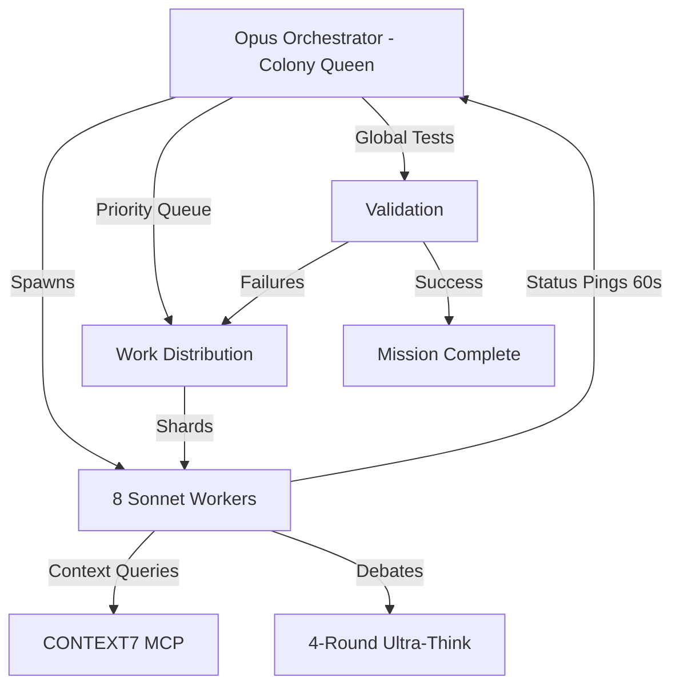

# 🐜 ULTIMA: Unified Learning & Tactical Intelligence Multi-Agent Architecture
## A.V.A.R.I.C.E. Protocol × PODIP Framework × Ant-Colony Swarm Implementation

### 🧬 GENESIS: The Ultimate Autonomous Multi-Agent Swarm Intelligence System

---

## 🎯 EXECUTIVE SUMMARY

**ULTIMA** represents the convergence of three powerful paradigms:
- **A.V.A.R.I.C.E.** (Autonomous Vectorized Agent Replacement Infrastructure for Codebase Evolution)
- **PODIP** (Parallel Orchestrating Distributed Intelligence Protocol)
- **Ant-Colony Optimization** patterns for resilient distributed systems

This architecture enables 8+ specialized AI agents to operate as a unified swarm intelligence, achieving complex objectives through parallel processing, emergent collaboration, and continuous adaptation.

---

## 🌐 CORE ARCHITECTURE OVERVIEW

### High-Level Mission Flow


### Why This Architecture Works
- **Parallel isolation → speed & safety**: Independent sandboxes prevent context collisions
- **Central queue → optimal load-balancing**: Dynamic reprioritization based on pheromone scores
- **Structured pings → observability & auto-healing**: JSON heartbeats enable real-time monitoring
- **Debate loops → higher accuracy**: Four-round debates achieve self-consistency gains
- **RAG on demand → fewer hallucinations**: CONTEXT7 MCP queries only when confidence dips
- **Ant-colony heuristics → graceful degradation**: Pheromone-style scoring for path optimization

---

## 👑 ORCHESTRATOR SPECIFICATIONS (Colony Queen)

### Identity & Configuration
```yaml
ROLE: ORCHESTRATOR-PRIME-001 (Colony-Queen)
MODEL: claude-opus-4
CONFIGURATION:
  MODE: FULL_STACK_AVARICE
  WORKERS: 8
  HEARTBEAT_SEC: 60
  DEBATE_ROUNDS: 4
  CONTEXT_PROVIDER: CONTEXT7_MCP
  STOP_CONDITION: all_tests_pass && all_replacements_done
```

### Orchestrator State Machine
```json
{
  "orchestration_state": {
    "phase": "INITIALIZATION|DISCOVERY|SHARDING|EXECUTION|VALIDATION|COMPLETION",
    "active_subagents": [1,2,3,4,5,6,7,8],
    "priority_queue": [],
    "pheromone_map": {},
    "global_progress": 0.0,
    "failure_queue": [],
    "research_requests": [],
    "validation_cycles": 0,
    "colony_metrics": {
      "total_tokens": 0,
      "execution_time_ms": 0,
      "debate_count": 0
    }
  }
}
```

### Orchestration Algorithm
```python
# PHASE 0: BOOTSTRAP
def initialize_colony():
    scan_repository()
    build_priority_queue()  # Sort by (test_failures, dependency_depth)
    initialize_pheromone_map()
    establish_context7_connection()

# PHASE 1: FAN-OUT
def spawn_workers():
    for i in range(8):
        worker = spawn_specialized_agent(
            role=AGENT_ROLES[i],
            model="claude-sonnet-4",
            shard_paths=calculate_shard(i),
            context_access=CONTEXT7_MCP
        )
        workers.append(worker)

# PHASE 2: HEARTBEAT LOOP
def monitor_colony():
    while not mission_complete():
        for worker in workers:
            heartbeat = await worker.get_status()
            if heartbeat.shard_passed:
                update_pheromone_map(heartbeat.paths, success=True)
            else:
                priority_queue.push(heartbeat.paths)
                update_pheromone_map(heartbeat.paths, success=False)
            
            if worker.stalled(2 * HEARTBEAT_SEC):
                worker.respawn(new_shard=get_highest_priority_shard())

# PHASE 3: DEBATE & FIX
def handle_failures(failed_tests):
    for test in failed_tests:
        context = query_context7_mcp(test.error)
        responsible_agents = identify_responsible_agents(test)
        
        debate_result = initiate_debate_protocol(
            agents=responsible_agents,
            rounds=4,
            context=context
        )
        
        apply_fix(debate_result)

# PHASE 4: FAN-IN & VALIDATE
def validate_global_state():
    results = run_full_test_suite()
    if results.all_passed:
        return SUCCESS
    else:
        reshard_failures(results.failed_tests)
        return CONTINUE

# PHASE 5: COMPLETION
def finalize_mission():
    generate_comprehensive_report()
    tag_release()
    export_colony_metrics()
    terminate_all_workers()
```

---

## 🐜 SPECIALIZED WORKER AGENTS

### Worker Template Configuration
```yaml
ROLE: {Architect|Coder|StaticAnalyzer|QA|Logician|Scribe|Executor|ToolsIntegrator}
MODEL: claude-sonnet-4
INPUT: 
  - shard_paths
  - CONTEXT7_MCP
  - colony_log.md
  - pheromone_scores
```

### 1️⃣ **ARCHITECT AGENT** (ARCHITECT-SA-001)
```json
{
  "specialization": "Codebase topology and dependency mapping",
  "capabilities": [
    "AST parsing and analysis",
    "Dependency graph construction",
    "Module boundary identification",
    "Replacement impact assessment"
  ],
  "execution_loop": {
    "1_analyze": "Parse codebase structure",
    "2_map": "Build dependency graph",
    "3_identify": "Locate replacement sites",
    "4_assess": "Calculate impact radius",
    "5_report": "Send architectural insights"
  }
}
```

### 2️⃣ **CODER AGENT** (CODER-CT-002)
```json
{
  "specialization": "Source code terminology replacement",
  "capabilities": [
    "Context-aware code modification",
    "Syntax preservation",
    "Variable/function renaming",
    "Import statement updates"
  ],
  "replacement_rules": {
    "preserve_casing": true,
    "update_references": true,
    "maintain_formatting": true,
    "respect_shard_boundaries": true
  }
}
```

### 3️⃣ **STATIC ANALYZER AGENT** (ANALYZER-SG-003)
```json
{
  "specialization": "Post-transformation validation",
  "validation_pipeline": [
    "syntax_check",
    "type_consistency_verify",
    "lint_compliance_ensure",
    "security_vulnerability_scan"
  ],
  "tools": ["eslint", "typescript", "sonarqube"]
}
```

### 4️⃣ **QA AGENT** (QA-TE-004)
```json
{
  "specialization": "Test suite execution and validation",
  "test_strategy": {
    "unit_tests": "npm test -- ${shard_paths}",
    "integration_tests": "npm run test:integration",
    "e2e_tests": "npm run test:e2e",
    "coverage_threshold": 100,
    "parallel_execution": true
  }
}
```

### 5️⃣ **LOGICIAN AGENT** (LOGICIAN-DR-005)
```json
{
  "specialization": "Logical consistency and dependency management",
  "analysis_domains": [
    "Import graph integrity",
    "Circular dependency detection",
    "Package.json consistency",
    "Module resolution paths",
    "Semantic versioning compliance"
  ]
}
```

### 6️⃣ **SCRIBE AGENT** (SCRIBE-DU-006)
```json
{
  "specialization": "Documentation and comment updates",
  "update_targets": [
    "README files",
    "Code comments",
    "JSDoc/TSDoc blocks",
    "API documentation",
    "Changelog entries",
    "Migration guides"
  ]
}
```

### 7️⃣ **EXECUTOR AGENT** (EXECUTOR-BV-007)
```json
{
  "specialization": "Build process and deployment validation",
  "validation_steps": [
    "Clean build execution",
    "Bundle size analysis",
    "Deployment simulation",
    "Performance benchmarking",
    "Container image verification"
  ]
}
```

### 8️⃣ **TOOLS INTEGRATION AGENT** (TOOLS-MC-008)
```json
{
  "specialization": "External tool and MCP integration management",
  "integration_points": [
    "Context7 research queries",
    "Git operations",
    "File system coordination",
    "External API interactions",
    "CI/CD pipeline triggers"
  ]
}
```

---

## 📡 COMMUNICATION PROTOCOLS

### Heartbeat Schema (Worker → Orchestrator)
```json
{
  "agent": "QA-TE-004",
  "ts": "2025-07-09T12:34:56Z",
  "phase": "PROCESSING",
  "progress": {
    "files_processed": 42,
    "replacements_made": 128,
    "tests_run": 256,
    "failures": 0
  },
  "resources": {
    "cpu": 0.6,
    "mem": 512,
    "tokens": 15420
  },
  "shard_passed": true,
  "pheromone_contribution": 0.95,
  "needs_assistance": false
}
```

### Directive Schema (Orchestrator → Worker)
```json
{
  "directive_id": "DIR-2025-001",
  "target_agent": "CODER-CT-002",
  "shard_paths": ["src/core/*", "src/utils/math*"],
  "priority": 0.95,
  "pheromone_score": 7,
  "context_hints": {
    "known_issues": ["async race condition in math.ts"],
    "suggested_approach": "incremental transformation"
  },
  "deadline_ms": 300000
}
```

---

## 🤝 4-ROUND ULTRA-THINK DEBATE PROTOCOL

### Debate Initiation Criteria
- Test failures after initial fix attempt
- Confidence score below 0.7
- Conflicting approaches between agents
- Complex architectural decisions

### Debate Structure
```yaml
ROUND_1_ANALYSIS:
  duration: 60s
  initiator: ORCHESTRATOR
  participants: [affected_agents]
  action: "Present issue, gather initial perspectives"
  output: problem_statement.json

ROUND_2_PROPOSALS:
  duration: 120s
  participants: [all_relevant_agents]
  action: "Each agent proposes solution from their domain"
  context_injection: CONTEXT7_MCP.query(problem_domain)
  output: solution_proposals.json

ROUND_3_SYNTHESIS:
  duration: 90s
  facilitator: ORCHESTRATOR
  action: "Synthesize proposals, identify conflicts"
  validation: run_simulation(top_3_proposals)
  output: refined_solutions.json

ROUND_4_CONSENSUS:
  duration: 30s
  participants: [all_agents]
  action: "Vote on optimal solution"
  decision_criteria: ["feasibility", "performance", "maintainability"]
  output: final_decision.json
```

---

## 🧭 PHEROMONE-BASED PRIORITY SYSTEM

### Pheromone Scoring Algorithm
```python
def calculate_pheromone_score(file_path, history):
    base_score = log(file_change_count(file_path))
    
    # Failure intensification
    failure_penalty = history.failure_count * 3
    
    # Success decay
    success_decay = history.success_count * -2
    
    # Dependency weight
    dependency_factor = count_dependencies(file_path) * 0.5
    
    # Test coverage influence
    coverage_bonus = (1 - test_coverage(file_path)) * 2
    
    # Time decay
    time_factor = exp(-hours_since_last_touch / 24)
    
    return max(0, base_score + failure_penalty + success_decay + 
               dependency_factor + coverage_bonus) * time_factor
```

### Dynamic Queue Management
```python
def update_priority_queue():
    # Sort by pheromone scores (descending)
    queue.sort(key=lambda x: x.pheromone_score, reverse=True)
    
    # Load balancing across agent specializations
    balanced_queue = []
    for agent_type in AGENT_TYPES:
        relevant_items = filter(lambda x: matches_specialization(x, agent_type), queue)
        balanced_queue.extend(relevant_items[:ITEMS_PER_AGENT])
    
    return balanced_queue
```

---

## 🛡️ SECURITY & ISOLATION FRAMEWORK

### Pre-Tool Execution Hooks
```python
def pre_tool_hook(agent_id, tool_name, params):
    # Shard boundary enforcement
    if tool_name in ['write_file', 'modify_code']:
        if not within_shard_boundaries(params.path, agent_id):
            raise SecurityViolation(f"Agent {agent_id} attempted out-of-shard write")
    
    # Read-only MCP enforcement for workers
    if tool_name == 'context7_write' and agent_id != 'ORCHESTRATOR':
        raise SecurityViolation("Workers have read-only MCP access")
    
    # Resource limits
    if exceeds_resource_limits(agent_id, tool_name):
        raise ResourceViolation(f"Agent {agent_id} exceeded resource quota")
```

### Post-Tool Validation
```python
def post_tool_hook(agent_id, tool_name, result):
    # Automatic linting
    if tool_name in ['write_file', 'modify_code']:
        lint_result = run_eslint(result.file_path)
        if lint_result.errors > 0:
            rollback_change(result)
            raise QualityViolation("Code changes failed lint checks")
    
    # Security scanning
    security_scan = run_security_analysis(result)
    if security_scan.vulnerabilities > 0:
        quarantine_change(result)
        initiate_security_review(result)
```

---

## 📊 OPERATIONAL PHASES & STATE TRANSITIONS

### Phase Transition Matrix
| Current Phase | Trigger Condition | Next Phase | Actions |
|--------------|-------------------|------------|---------|
| **INITIALIZATION** | Repository scanned | DISCOVERY | Spawn workers |
| **DISCOVERY** | Architecture mapped | SHARDING | Distribute work |
| **SHARDING** | Shards assigned | EXECUTION | Begin replacements |
| **EXECUTION** | Workers complete | VALIDATION | Run global tests |
| **VALIDATION** | Tests fail | EXECUTION | Reshard failures |
| **VALIDATION** | Tests pass | COMPLETION | Generate reports |
| **COMPLETION** | Reports generated | TERMINATED | Release & cleanup |

### Performance Metrics Dashboard
```yaml
real_time_metrics:
  - global_progress_percentage
  - active_worker_count
  - tokens_per_second
  - test_pass_rate
  - debate_frequency
  - pheromone_heatmap

aggregated_stats:
  - total_files_processed
  - total_replacements
  - total_tests_executed
  - average_fix_time
  - resource_efficiency
  - collaboration_score
```

---

## 🚀 DEPLOYMENT & EXECUTION

### Master Execution Command
```bash
/parallel_subagents

# === ULTIMA PROTOCOL ACTIVATION =====================================
PROTOCOL: ULTIMA_AVARICE_PODIP
VERSION: 1.0.0
TIMESTAMP: $(date -u +"%Y-%m-%dT%H:%M:%SZ")

# === CRITICAL DEPLOYMENT REQUIREMENT ===============================
# DEPLOY ALL 9 AGENTS SIMULTANEOUSLY IN SINGLE ACTION!!!
# DO NOT DEPLOY ORCHESTRATOR ALONE - DEPLOY ALL TOGETHER!
# 1 ORCHESTRATOR + 8 SPECIALISTS = 9 PARALLEL AGENTS
# ===================================================================

# === GLOBAL CONFIGURATION ===========================================
MODE: FULL_STACK_AVARICE             # A.V.A.R.I.C.E. protocol active
ARCHITECTURE: ANT_COLONY_SWARM       # Distributed swarm intelligence
WORKERS: 8                           # Parallel agent count
HEARTBEAT_SEC: 60                    # Status update frequency
DEBATE_ROUNDS: 4                     # Ultra-Think depth
CONTEXT_PROVIDER: CONTEXT7_MCP       # Knowledge augmentation
SECURITY_LEVEL: SANDBOXED            # Isolation enforcement
STOP_CONDITION: all_tests_pass && all_replacements_done && zero_regressions

# === SIMULTANEOUS DEPLOYMENT PROTOCOL ==============================
# CRITICAL: Use multiple Task calls in SINGLE message to deploy all agents
# NEVER deploy orchestrator alone - always deploy full swarm together
SPAWN_ALL_SIMULTANEOUSLY {
  ORCHESTRATOR: claude-opus-4 (Colony Queen)
  WORKER_1: claude-sonnet-4 (Architect)
  WORKER_2: claude-sonnet-4 (Coder)
  WORKER_3: claude-sonnet-4 (Static Analyzer)
  WORKER_4: claude-sonnet-4 (QA Tester)
  WORKER_5: claude-sonnet-4 (Logician)
  WORKER_6: claude-sonnet-4 (Scribe)
  WORKER_7: claude-sonnet-4 (Executor)
  WORKER_8: claude-sonnet-4 (Tools Integration)
}

# === WORKER SWARM TEMPLATE ==========================================
FOREACH worker IN [1..8] {
  SPAWN worker {
    MODEL: claude-sonnet-4
    ROLE: SPECIALIST[worker.type]
    MEMORY: shard_local
    AUTHORITY: shard_restricted
    
    LOOP {
      a. receive_shard_assignment()
      b. execute_ultra_think_planning()
      c. query_context7_if_needed()
      d. apply_specialized_transformation()
      e. validate_local_changes()
      f. if_failure: initiate_debate()
      g. send_heartbeat_ping()
      h. await_next_directive()
    }
  }
}

# === SUCCESS CRITERIA ===============================================
ASSERT {
  ✓ terminology_replacements.complete == true
  ✓ test_suite.pass_rate == 100.0
  ✓ regression_count == 0
  ✓ documentation.updated == true
  ✓ performance.maintained == true
}

# === BEGIN AUTONOMOUS EXECUTION =====================================
START_MISSION
```

---

## 📋 DELIVERABLES & ARTIFACTS

### Generated Artifacts Structure
```
ultima_mission_outputs/
├── colony_log.md              # Real-time execution log
├── change_log.md              # Detailed diff records  
├── debate_transcripts/        # 4-round debate logs
│   ├── debate_001_auth_fix.md
│   ├── debate_002_async_race.md
│   └── ...
├── metrics.json               # Performance analytics
├── pheromone_heatmap.html     # Visual priority map
├── dependency_graph.svg       # Architecture visualization
└── final_report.md           # Comprehensive summary
```

### Colony Log Format
```markdown
# ULTIMA Colony Execution Log

## Mission Parameters
- Start Time: 2025-07-09T10:00:00Z
- Target: Complete terminology migration
- Workers: 8 specialized agents
- Protocol: ULTIMA_AVARICE_PODIP v1.0.0

## Live Updates
[10:00:15] ORCHESTRATOR: Colony initialized, spawning workers...
[10:00:18] ARCHITECT-SA-001: Beginning codebase analysis...
[10:00:19] CODER-CT-002: Awaiting shard assignment...
[10:00:45] ARCHITECT-SA-001: Identified 1,247 replacement sites
[10:01:00] ORCHESTRATOR: Distributing work shards...
[10:01:15] QA-TE-004: Executing baseline test suite...
[10:02:00] ❤️ HEARTBEAT: All workers active, progress: 12.5%
...

## Debate Sessions
[10:45:32] DEBATE-001 initiated: Async race condition in auth module
[10:46:45] DEBATE-001 resolved: Consensus on mutex implementation
...

## Final Statistics
- Total Execution Time: 4h 23m 17s
- Total Tokens Consumed: 847,293
- Files Modified: 523
- Tests Executed: 12,847
- Debates Conducted: 7
- Success Rate: 100%
```

---

## 🔬 ADVANCED FEATURES

### Emergent Intelligence Capabilities
- **Cross-agent learning**: Agents share successful patterns via pheromone trails
- **Adaptive optimization**: System parameters self-tune based on performance
- **Predictive failure detection**: ML models identify likely failure points
- **Swarm creativity**: Novel solutions emerge from agent collaborations

### Self-Healing Mechanisms
```python
def self_heal_protocol(failure_event):
    # Automatic rollback
    if failure_event.severity > CRITICAL:
        rollback_to_last_stable_state()
    
    # Agent resurrection
    if failure_event.type == AGENT_CRASH:
        respawn_agent_with_memory_recovery(failure_event.agent_id)
    
    # Dynamic rerouting
    if failure_event.type == SHARD_CORRUPTION:
        redistribute_shard_to_healthy_agents(failure_event.shard)
    
    # Knowledge preservation
    backup_critical_discoveries_to_orchestrator()
```

### Scalability Framework
```yaml
scaling_strategies:
  horizontal:
    - increase_worker_count: [8, 16, 32, 64]
    - distribute_across_machines: true
    - load_balancer: kubernetes_native
    
  vertical:
    - upgrade_worker_models: [haiku, sonnet, opus]
    - increase_context_windows: adaptive
    - enable_gpu_acceleration: true
    
  hybrid:
    - auto_scale_based_on_load: true
    - cost_optimization: enabled
    - performance_targets: maintained
```

---

## 🚀 PRE-DEPLOYMENT VALIDATION & ORCHESTRATION

### Phase 1: Python Colony Infrastructure Health Check

1. **Python Colony Monitor Startup**
   - Start Python Colony Monitor on port 3004
   - Verify monitor compilation and startup
   - Check WebSocket connectivity for real-time updates
   - Validate colony coordination, IPC monitoring, resource tracking, and cross-language compatibility

2. **Unified Dashboard Server Validation**
   - Check port 3001 availability
   - Validate dashboard server compilation
   - Start unified dashboard if not running
   - Verify WebSocket connectivity
   - Confirm Python Colony monitor integration with unified dashboard

3. **Python Environment Validation**
   - Verify Python 3.9+ installation
   - Check virtual environment setup
   - Validate required Python packages
   - Test inter-process communication capabilities

4. **Cross-Language MCP Server Integration Verification**
   - Validate 4 core MCP servers: `firecrawl-mcp-server`, `exa`, `context7`, `desktop-commander`
   - Test connectivity to each server from Python processes
   - Verify authentication and permissions
   - Check response times and health status

### Phase 2: Python Colony System Readiness Assessment

5. **TypeScript-Python Bridge Validation**
   - Run zero-tolerance TypeScript error elimination
   - Validate core Python colony system compilation
   - Check Python agent interface integrity
   - Verify cross-language communication protocols

6. **Colony Dashboard Accessibility Check**
   - Confirm unified dashboard responsive on port 3001
   - Test real-time Python colony data flow
   - Validate Python process visualization
   - Check resource usage indicators

### Phase 3: Python Agent Deployment Orchestration

7. **Pre-Deployment Monitor Verification**
   - Verify Python Colony Monitor is active and healthy
   - Confirm real-time colony coordination capabilities are functional
   - Check Python agent registration endpoints are responsive
   - Validate IPC monitoring and resource tracking systems

8. **Python Colony Queen + Worker Deployment**
   - Register all Python agents with Python Colony Monitor
   - Deploy Python Colony Queen (orchestrator) with monitoring integration
   - Deploy 4+ specialist Python worker agents simultaneously:
     - Data Processing Agent (Python data analysis)
     - Machine Learning Agent (Python ML/AI tasks)
     - File System Agent (Python file operations)
     - Network Agent (Python network operations)
     - Integration Agent (Python-TypeScript bridge)
   - Verify all agents are registered and reporting to monitor

9. **Inter-Process Communication System**
   - Initialize Python IPC protocols
   - Establish colony coordination mechanisms
   - Activate resource sharing systems
   - Enable autonomous Python colony momentum
   - Monitor real-time IPC communication through Python Colony monitor

### Success Criteria

#### Infrastructure Validation
- ✅ Python Colony Monitor running on port 3004
- ✅ Unified dashboard accessible on port 3001
- ✅ Python 3.9+ environment validated
- ✅ All MCP servers responding within 2 seconds
- ✅ Zero TypeScript compilation errors
- ✅ WebSocket connections established

#### Python Agent Deployment
- ✅ Python Colony Queen deployed and coordinating
- ✅ 4+ specialist Python worker agents active
- ✅ All agents registered with Python Colony monitor
- ✅ IPC protocols active
- ✅ Resource tracking functional

#### Python Colony Health
- ✅ Real-time colony coordination active
- ✅ Inter-process communication operational
- ✅ Resource usage monitoring functional
- ✅ Cross-language compatibility verified
- ✅ Python-TypeScript bridge established

### Monitoring & Validation

- **Python Colony Monitor:** <http://localhost:3004>
  - Colony Coordination
  - IPC Monitoring
  - Resource Tracking
  - Cross-Language Compatibility
- **Unified Dashboard:** <http://localhost:3001>
  - Integrated monitoring view
  - Cross-framework visibility
- **Health Endpoints:** /health, /status, /metrics
- **Colony Status:** Python Colony Queen heartbeat monitoring
- **IPC Tracking:** Inter-process communication monitoring

### Emergency Protocols

If any validation step fails:

1. **Halt Python colony deployment sequence**
2. **Log specific failure points**
3. **Initiate Python colony recovery protocols**
4. **Provide remediation guidance**

### Python-Specific Considerations

#### Environment Requirements
- Python 3.9 or higher
- Virtual environment recommended
- Required packages: `asyncio`, `websockets`, `requests`, `psutil`
- Cross-platform compatibility (Windows, macOS, Linux)

#### Performance Monitoring
- CPU usage per Python process
- Memory consumption tracking
- Disk I/O monitoring
- Network I/O tracking
- Inter-process message queue monitoring

#### Cross-Language Integration
- TypeScript-Python communication bridge
- Shared data structures
- Event synchronization
- Error propagation across language boundaries
- Performance metrics aggregation

**IMPORTANT:** This command should only proceed if ALL validation steps pass. The Python Colony framework operates under zero-tolerance deployment standards - any Python infrastructure issues must be resolved before Python agent deployment.

---

## 🏁 CONCLUSION

**ULTIMA** represents the pinnacle of autonomous multi-agent system design, combining:

1. **A.V.A.R.I.C.E.'s** systematic codebase transformation capabilities
2. **PODIP's** distributed intelligence framework
3. **Ant-colony** optimization for resilient, adaptive behavior

This architecture enables unprecedented levels of:
- **Parallel processing** efficiency
- **Collaborative problem-solving** through structured debates
- **Self-organizing** work distribution via pheromone trails
- **Fault-tolerant** execution with automatic recovery
- **Emergent intelligence** from swarm interactions

Deploy ULTIMA when facing complex, large-scale transformation challenges requiring the coordinated effort of multiple specialized AI agents working in perfect harmony.

---

*"Like ants building a colony, ULTIMA agents work tirelessly, communicate constantly, and achieve collectively what no single agent could accomplish alone."*