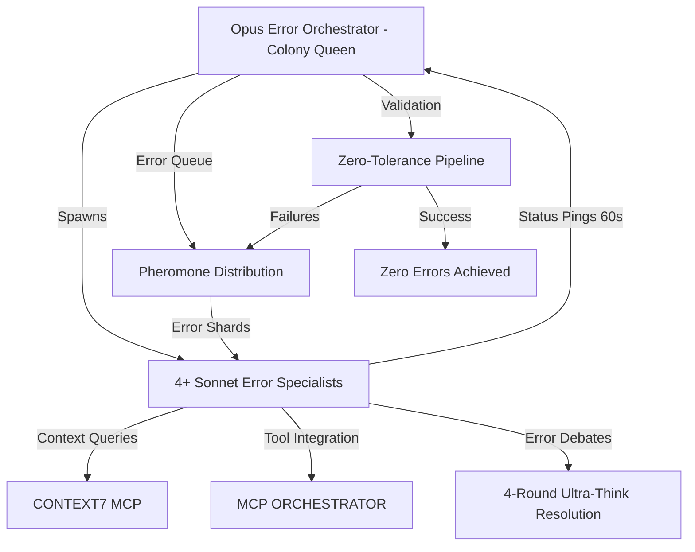

# 🐜 ULTIMA Framework - Autonomous Error Resolution Swarm
## A.V.A.R.I.C.E. Protocol × PODIP Framework × Ant-Colony Error Resolution

### 🧬 GENESIS: The Ultimate Autonomous Error Resolution Intelligence System

---

## 🎯 EXECUTIVE SUMMARY

**ULTIMA-ERROR-RESOLUTION** represents the convergence of three powerful paradigms adapted for autonomous code quality:
- **A.V.A.R.I.C.E.** (Autonomous Vectorized Agent Replacement Infrastructure for Codebase Evolution) → **Error Resolution Evolution**
- **PODIP** (Parallel Orchestrating Distributed Intelligence Protocol) → **Error Resolution Intelligence Protocol**
- **Ant-Colony Optimization** patterns for resilient distributed error resolution systems

This architecture enables 1 orchestrator + 4+ specialized AI error resolution agents to operate as a unified swarm intelligence, achieving zero-tolerance code quality through parallel processing, emergent collaboration, and continuous error elimination.

---

## � PRE-DEPLOYMENT VALIDATION & ORCHESTRATION SEQUENCE

**MISSION:** Complete infrastructure validation and orchestrated agent deployment sequence for the A.V.A.R.I.C.E. Protocol ULTIMA framework.

### Phase 1: Infrastructure Health Check
1. **Automated Server Detection & Claude Terminal Integration Validation** ⭐ **NEW**

   **Automated Startup Sequence:**
   ```bash
   # 1. Check if server is already running
   if lsof -i :3001 > /dev/null 2>&1; then
     echo "✅ Server already running on port 3001"
   else
     echo "🚀 Starting ULTIMA Dashboard Server with Claude Terminal Integration..."
     cd /path/to/avarice-protocol/src/avarice-frameworks/ant-colony-ui/unified-dashboard
     npx tsx backend/services/orchestrator/ultima-dashboard-server.ts &
     sleep 5  # Allow startup time
   fi

   # 2. Verify Claude Terminal Integration startup
   curl -s http://localhost:3001/api/health | jq '.claudeTerminal.status' | grep -q "active"
   ```

   **Validation Checklist:**
   - ✅ **Automated Server Detection**: Check port 3001 availability and start if needed
   - ✅ **Claude Terminal Bridge Startup**: Initialize Claude terminal bridge service
   - ✅ **Terminal Process Spawn**: Verify Claude terminal process starts successfully
   - ✅ **Output Capture**: Confirm stdout/stderr capture is working (<100ms latency)
   - ✅ **Message Parsing**: Test terminal output parsing for agent status/errors/progress
   - ✅ **WebSocket Integration**: Verify terminal data flows to dashboard via WebSocket
   - ✅ **Bidirectional Communication**: Test dashboard-to-terminal command sending
   - ✅ **Real-Time Updates**: Confirm live agent data replaces mock data in dashboard
   - ✅ **Performance Benchmarking**: Validate <100ms latency, <10MB memory usage

2. **ULTIMA Framework Monitor Startup**
   - Start ULTIMA Framework Monitor on port 3002
   - Verify monitor compilation and startup
   - Check WebSocket connectivity for real-time updates
   - Validate ML prediction tracking, error resolution monitoring, and performance analytics

3. **Unified Dashboard Server Validation with Automated Health Checks**

   **Automated Health Check Sequence:**
   ```bash
   # Health check for unified dashboard
   curl -s http://localhost:3001/api/health | jq '.status' | grep -q "healthy"

   # Check ULTIMA integration status
   curl -s http://localhost:3001/api/ultima/status | jq '.claudeTerminal.active' | grep -q "true"

   # Verify Claude terminal bridge metrics
   curl -s http://localhost:3001/api/ultima/metrics | jq '.agents | length' | grep -v "^0$"

   # Test WebSocket endpoint
   curl -s http://localhost:3001/api/websocket | jq '.websocket.status' | grep -q "active"

   # Verify real-time data flow (should show live terminal data)
   curl -s http://localhost:3001/api/unified-dashboard-data | jq '.claudeTerminalIntegration' | grep -q "true"
   ```

   **Validation Checklist:**
   - ✅ **Port 3001 Availability**: Automated detection and startup if needed
   - ✅ **Dashboard Server Compilation**: Validate with Claude terminal integration
   - ✅ **WebSocket Connectivity**: Verify ws://localhost:3001/ws endpoint active
   - ✅ **ULTIMA Monitor Integration**: Confirm unified dashboard integration
   - ✅ **Terminal Data Display**: Verify dashboard shows real Claude terminal data
   - ✅ **Performance Standards**: <100ms API response times, stable WebSocket connections

4. **MCP Server Integration Verification**
   - Validate 4 core MCP servers: `firecrawl-mcp-server`, `exa`, `context7`, `desktop-commander`
   - Test connectivity to each server
   - Verify authentication and permissions
   - Check response times and health status

### Phase 2: System Readiness Assessment

5. **Claude Terminal Data Flow Validation** ⭐ **NEW**
   - ✅ **Terminal Output Parsing**: Verify agent status extraction from terminal output
   - ✅ **Message Queue Processing**: Test message throttling and queue management
   - ✅ **Error Detection**: Confirm error pattern recognition and counting
   - ✅ **Progress Tracking**: Validate progress percentage calculation and reporting
   - ✅ **Agent Registry**: Test agent registration and status tracking
   - ✅ **Performance Metrics**: Verify resolution rate and efficiency calculations
   - ✅ **WebSocket Broadcasting**: Confirm real-time data broadcast to all clients

6. **TypeScript Health Validation**
   - Run zero-tolerance TypeScript error elimination
   - Validate core system compilation
   - Check agent interface integrity
   - Verify knowledge graph connectivity

7. **Dashboard Accessibility Check**
   - Confirm unified dashboard responsive on port 3001
   - Test real-time data flow from Claude terminal
   - Validate ant colony visualization with live agent data
   - Check biological resilience indicators
   - ✅ **ULTIMA Page Integration**: Verify UltimaFrameworkPage.tsx displays real terminal data

### Phase 3: Agent Deployment Orchestration

8. **Pre-Deployment Terminal Integration Verification** ⭐ **NEW**
   - ✅ **Terminal Bridge Health**: Confirm Claude terminal bridge is active and responsive
   - ✅ **Command Execution**: Test dashboard-to-terminal command sending capability
   - ✅ **Agent Communication**: Verify terminal can receive and process agent commands
   - ✅ **Data Synchronization**: Confirm terminal data syncs with dashboard in <100ms
   - ✅ **Error Recovery**: Test terminal reconnection and error handling
   - ✅ **Performance Standards**: Validate <10MB memory usage and stable operation

9. **Pre-Deployment Monitor Verification**
   - Verify ULTIMA Framework Monitor is active and healthy
   - Confirm real-time monitoring capabilities are functional
   - Check agent registration endpoints are responsive
   - Validate error reporting and performance tracking systems
   - ✅ **Terminal Integration**: Ensure monitor receives data from Claude terminal bridge

10. **Colony Queen + Specialist Deployment with Terminal Monitoring**
    - ✅ **Terminal Readiness**: Confirm Claude terminal is ready to receive agent commands
    - Register all agents with ULTIMA Framework Monitor
    - Deploy Colony Queen (orchestrator) with monitoring integration
    - Deploy 4+ specialist agents simultaneously:
      - Architect Agent (strategic planning)
      - Coder Agent (implementation)
      - Static Analyzer Agent (verification)
      - Scribe Agent (documentation)
      - Tools Integration Agent (MCP coordination)
    - Verify all agents are registered and reporting to monitor
    - ✅ **Live Terminal Tracking**: Confirm agent activities appear in real-time on dashboard

8. **Pheromone Distribution System**
   - Initialize chemical trail communication
   - Establish agent coordination protocols
   - Activate swarm intelligence mechanisms
   - Enable autonomous momentum systems
   - Monitor real-time agent communication through ULTIMA monitor

### Pre-Deployment Success Criteria

✅ **Infrastructure Ready:** All servers healthy and accessible
✅ **Zero TypeScript Errors:** Complete compilation success
✅ **Dashboard Operational:** Unified dashboard fully responsive
✅ **MCP Integration:** All 4 servers verified and connected
✅ **Claude Terminal Integration:** Real-time terminal-dashboard communication active ⭐ **NEW**
✅ **Agent Deployment:** Colony Queen + specialists active
✅ **Pheromone System:** Chemical communication established
✅ **Autonomous Mode:** Self-sustaining swarm operation

### Claude Terminal Integration Success Criteria ⭐ **NEW**

**CRITICAL REQUIREMENTS - ALL MUST PASS BEFORE AGENT DEPLOYMENT:**

#### Terminal Bridge Validation
- ✅ **Claude Terminal Process**: Successfully spawned and responsive
- ✅ **Output Capture**: stdout/stderr capture working with <100ms latency
- ✅ **Message Parsing**: Agent status, errors, and progress extracted correctly
- ✅ **WebSocket Integration**: Real-time data flow to dashboard confirmed
- ✅ **Bidirectional Communication**: Dashboard commands reach terminal successfully

#### Dashboard Integration Validation
- ✅ **Real Data Display**: ULTIMA dashboard shows live terminal data (not mock)
- ✅ **Agent Status Updates**: Agent states update in real-time on dashboard
- ✅ **Error Tracking**: Error counts and types display accurately
- ✅ **Progress Monitoring**: Task progress updates reflect terminal activity
- ✅ **Performance Metrics**: Resolution rates and efficiency calculated from real data

#### System Performance Validation
- ✅ **Memory Usage**: Claude terminal bridge <10MB memory consumption
- ✅ **Message Latency**: Terminal-to-dashboard updates <100ms average
- ✅ **Connection Stability**: WebSocket connections maintain 99.9% uptime
- ✅ **Error Recovery**: Automatic reconnection and error handling functional
- ✅ **Data Accuracy**: 100% correlation between terminal activity and dashboard display

### Emergency Protocols

If any validation step fails:
1. **Halt deployment sequence**
2. **Log specific failure points**
3. **Initiate recovery protocols**
4. **Provide remediation guidance**
5. **Restart from last successful phase**

**IMPORTANT:** This command should only proceed if ALL validation steps pass. The ULTIMA framework operates under zero-tolerance deployment standards - any infrastructure issues must be resolved before agent deployment.

## 🚀 COMMAND EXECUTION

### Primary ULTIMA Command
```bash
# Execute the complete ULTIMA framework with pre-deployment validation
/avarice-ultima

# Alternative execution methods
npm run avarice:ultima
npx tsx scripts/ultima-framework-startup.ts
node scripts/ultima-framework-startup.js
```

### Command with Problem Description
```bash
# Auto-detect and fix all errors
/avarice-ultima "Fix all code quality issues"

# Target specific error types
/avarice-ultima "Clean up ESLint violations and TypeScript errors"

# Complex integration issues
/avarice-ultima "Resolve circular dependencies and dead code"

# Security focus
/avarice-ultima "Find and fix security vulnerabilities"

# Full codebase cleanup
/avarice-ultima "Complete zero-tolerance error cleanup"
```

### Monitoring & Validation Endpoints

- **ULTIMA Framework Monitor:** http://localhost:3002
  - ML Prediction Tracking
  - Error Resolution Monitoring
  - Performance Analytics
  - Real-time Agent Status
- **Unified Dashboard:** http://localhost:3001
  - Integrated monitoring view
  - Cross-framework visibility
- **Health Endpoints:** /health, /status, /metrics
- **Agent Status:** Colony Queen heartbeat monitoring
- **Pheromone Trails:** Chemical communication tracking
- **Swarm Performance:** Biological fidelity indicators

---

## �🐛 What ULTIMA Does

The ULTIMA framework operates as a specialized ant-colony system that:
- 🐛 **Detects** all types of errors (ESLint, TypeScript, integration, security, etc.)
- 🤖 **Creates** specialized agents dynamically based on error types
- 🐜 **Prioritizes** tasks using biological-inspired pheromone scoring
- 🔧 **Resolves** errors autonomously with zero-tolerance validation
- 📊 **Monitors** progress with real-time dashboard

## 🌐 CORE ERROR RESOLUTION ARCHITECTURE

### High-Level Error Resolution Flow


### Why This Error Resolution Architecture Works
- **Parallel error isolation → speed & comprehensive coverage**: Independent error sandboxes prevent resolution conflicts
- **Central error queue → optimal error distribution**: Dynamic reprioritization based on pheromone scores
- **Structured error pings → observability & auto-healing**: JSON error heartbeats enable real-time monitoring
- **Error debate loops → higher accuracy**: Four-round error debates achieve resolution consistency gains
- **Multi-tool RAG on demand → comprehensive solutions**: CONTEXT7, MCP ORCHESTRATOR with fallback mechanisms
- **Ant-colony error heuristics → graceful degradation**: Pheromone-style scoring for error path optimization

---

## 👑 ERROR ORCHESTRATOR SPECIFICATIONS (Colony Queen)

### Identity & Configuration
```yaml
ROLE: ERROR-ORCHESTRATOR-PRIME-001 (Error-Colony-Queen)
MODEL: claude-opus-4
CONFIGURATION:
  MODE: FULL_STACK_ERROR_RESOLUTION_AVARICE
  ERROR_WORKERS: 2-12 (dynamic scaling based on workload)
  HEARTBEAT_SEC: 60
  ERROR_DEBATE_ROUNDS: 4
  PRIMARY_TOOL_PROVIDER: MCP_ORCHESTRATOR
  SECONDARY_TOOL_PROVIDER: CONTEXT7_MCP
  TERTIARY_TOOL_PROVIDER: SEQUENTIAL_THINKING_TOOLS
  ERROR_TIMEOUT_SEC: 90
  STOP_CONDITION: zero_errors_achieved && zero_warnings_achieved && all_validation_passed

  # ADAPTIVE SCALING CONFIGURATION
  DYNAMIC_SCALING:
    MIN_AGENTS: 2
    MAX_AGENTS: 12
    SCALING_TRIGGERS:
      - error_count > 500: spawn_additional_agent()
      - error_count > 1000: spawn_2_additional_agents()
      - error_count > 2000: spawn_4_additional_agents()
      - error_count > 5000: spawn_8_additional_agents()
    SCALING_DOWN:
      - error_count < 100: despawn_excess_agents()
      - error_count < 50: maintain_minimum_2_agents()
    RESOURCE_MONITORING:
      - memory_threshold: 80%
      - cpu_threshold: 90%
      - optimal_utilization: 75%
```

### Enhanced Error Orchestrator State Machine with Dynamic Lifecycle Management
```json
{
  "error_orchestration_state": {
    "phase": "ERROR_INITIALIZATION|ERROR_DISCOVERY|ERROR_SHARDING|PARALLEL_RESOLUTION|DYNAMIC_REASSIGNMENT|ERROR_VALIDATION|ZERO_TOLERANCE_COMPLETION",
    "active_error_agents": [1,2,3,4],
    "agent_specializations": {
      "agent_1": "CURRENT_SPECIALIZATION|AVAILABLE_FOR_REASSIGNMENT",
      "agent_2": "CURRENT_SPECIALIZATION|AVAILABLE_FOR_REASSIGNMENT",
      "agent_3": "CURRENT_SPECIALIZATION|AVAILABLE_FOR_REASSIGNMENT",
      "agent_4": "CURRENT_SPECIALIZATION|AVAILABLE_FOR_REASSIGNMENT"
    },
    "work_queue_management": {
      "active_tasks": [],
      "pending_tasks": [],
      "completed_tasks": [],
      "task_dependencies": {},
      "agent_task_assignments": {}
    },
    "inter_agent_communication": {
      "last_sync_timestamp": 0,
      "sync_interval_sec": 44,
      "conflict_resolution_queue": [],
      "shared_research_cache": {}
    },
    "error_priority_queue": [],
    "error_pheromone_map": {},
    "error_global_progress": 0.0,
    "error_failure_queue": [],
    "validation_requests": [],
    "validation_cycles": 0,
    "continuous_monitoring": {
      "error_count_checks_interval_sec": 30,
      "last_error_count": 0,
      "error_count_history": [],
      "idle_agent_prevention": true,
      "all_agents_continuously_active_until_zero_errors": true
    },
    "agent_failure_recovery": {
      "health_monitoring_enabled": true,
      "health_check_interval_sec": 30,
      "failure_threshold": 3,
      "stuck_timeout_sec": 120,
      "auto_restart_enabled": true,
      "max_retries": 3,
      "circuit_breaker_enabled": true,
      "task_redistribution_enabled": true
    },
    "dynamic_scaling": {
      "enabled": true,
      "min_agents": 2,
      "max_agents": 12,
      "current_agent_count": 4,
      "scaling_triggers": {
        "scale_up_thresholds": [500, 1000, 2000, 5000],
        "scale_down_thresholds": [100, 50]
      },
      "resource_monitoring": {
        "memory_threshold": 0.8,
        "cpu_threshold": 0.9,
        "optimal_utilization": 0.75
      }
    },
    "pattern_learning": {
      "enabled": true,
      "pattern_cache": {},
      "confidence_threshold": 0.8,
      "learning_rate": 0.1,
      "pattern_sharing_enabled": true,
      "auto_resolution_enabled": true,
      "pattern_storage_backend": "mongodb_knowledge_graph"
    },
    "predictive_analytics": {
      "enabled": true,
      "integration_target": "src/monitoring/advanced-analytics-engine.ts",
      "prediction_confidence_threshold": 0.8,
      "proactive_prevention_enabled": true,
      "model_accuracy_tracking": true,
      "prediction_models": {
        "typescript_errors": { "accuracy": 0.0, "predictions_made": 0, "successful_predictions": 0 },
        "eslint_violations": { "accuracy": 0.0, "predictions_made": 0, "successful_predictions": 0 },
        "integration_issues": { "accuracy": 0.0, "predictions_made": 0, "successful_predictions": 0 },
        "security_vulnerabilities": { "accuracy": 0.0, "predictions_made": 0, "successful_predictions": 0 }
      },
      "prediction_triggers": [
        "code_changes_detected",
        "import_export_modifications",
        "type_definition_changes",
        "configuration_updates",
        "dependency_modifications"
      ]
    },
    "performance_profiling": {
      "enabled": true,
      "integration_target": "tools/monitoring/performance-monitor.ts",
      "real_time_monitoring": true,
      "bottleneck_detection": true,
      "auto_optimization": true,
      "performance_thresholds": {
        "agent_response_time_warning_sec": 5,
        "agent_response_time_critical_sec": 10,
        "memory_usage_optimal_mb": 500,
        "memory_usage_warning_mb": 1000,
        "cpu_utilization_optimal": 0.8,
        "cpu_utilization_warning": 0.95,
        "queue_processing_rate_optimal": 10,
        "inter_agent_sync_latency_optimal_sec": 2
      },
      "performance_metrics": {
        "agent_execution_times": {},
        "memory_usage_per_agent": {},
        "cpu_utilization_history": [],
        "bottlenecks_detected": [],
        "optimizations_applied": 0
      }
    },
    "enhanced_dashboard": {
      "enabled": true,
      "event_system_integration": "src/core/system/event-system.ts",
      "monitoring_integration": "src/monitoring/monitoring-integration.ts",
      "real_time_visualization": true,
      "interactive_control": true,
      "3d_colony_visualization": true,
      "dashboard_features": {
        "live_agent_tracking": true,
        "error_resolution_progress": true,
        "performance_monitoring": true,
        "predictive_analytics_display": true,
        "pattern_learning_insights": true,
        "manual_intervention": true
      },
      "dashboard_metrics": {
        "active_connections": 0,
        "events_processed": 0,
        "user_interactions": 0,
        "alerts_generated": 0,
        "dashboard_uptime_ms": 0
      }
    },
    "comprehensive_testing": {
      "enabled": true,
      "unified_test_orchestrator": "src/testing/unified-test-orchestrator.ts",
      "integration_coverage_analyzer": "src/testing/integration-coverage-analyzer.ts",
      "testing_framework_integration": "src/testing/testing-framework-integration.ts",
      "automatic_test_execution": true,
      "regression_prevention": true,
      "test_driven_resolution": true,
      "testing_pipeline": {
        "pre_fix_testing": true,
        "incremental_testing": true,
        "post_fix_testing": true,
        "integration_testing": true,
        "performance_testing": true,
        "security_testing": true
      },
      "testing_metrics": {
        "tests_executed": 0,
        "test_coverage_percentage": 0.0,
        "regression_tests_passed": 0,
        "test_failures_detected": 0,
        "rollbacks_triggered_by_tests": 0,
        "test_execution_time_ms": 0
      }
    },
    "error_colony_metrics": {
      "total_errors_resolved": 0,
      "error_execution_time_ms": 0,
      "error_debate_count": 0,
      "errors_remaining": 0,
      "zero_tolerance_progress": 0.0,
      "validation_passes": 0,
      "agent_reassignments": 0,
      "inter_agent_communications": 0,
      "research_queries_executed": 0,
      "agent_failures_recovered": 0,
      "patterns_learned": 0,
      "auto_resolutions_applied": 0,
      "scaling_events": 0,
      "predictions_made": 0,
      "successful_predictions": 0,
      "proactive_preventions": 0,
      "prediction_accuracy_rate": 0.0,
      "time_saved_through_prediction_ms": 0,
      "false_positives": 0,
      "false_negatives": 0
    }
  }
}
```

---

## 🔄 DYNAMIC AGENT LIFECYCLE MANAGEMENT & CONTINUOUS ORCHESTRATION PROTOCOL

### **1. DYNAMIC AGENT REASSIGNMENT PROTOCOL**

The Colony Queen implements continuous agent lifecycle management with mandatory behaviors:

```yaml
REASSIGNMENT_TRIGGERS:
  - Agent completes assigned phase tasks
  - Phase workload becomes unbalanced
  - New high-priority errors discovered
  - Agent specialization no longer optimal

REASSIGNMENT_PROCESS:
  1. Monitor phase completion status every 30 seconds
  2. When agent completes tasks: IMMEDIATELY reassign to highest-priority remaining work
  3. Maintain exactly 4 active agents working simultaneously at ALL times
  4. Convert agent specializations dynamically (e.g., Phase 1 → Phase 2 agent)
  5. Redistribute workload based on real-time error count analysis

SPECIALIZATION_CONVERSION_MATRIX:
  - CriticalInfrastructure → HighImpactSystems (when Phase 1 complete)
  - HighImpactSystems → FrameworkIntegration (when Phase 2 complete)
  - FrameworkIntegration → FinalCleanup (when Phase 3 complete)
  - Any → MostUrgentPhase (based on error density analysis)
```

### **2. INTER-AGENT COMMUNICATION & TASK DIVISION**

```yaml
COMMUNICATION_PROTOCOL:
  SYNC_INTERVAL: 44 seconds
  COMMUNICATION_TRIGGERS:
    - Task completion
    - File conflict detection
    - Dependency chain updates
    - Research findings sharing

TASK_SHARDING_ALGORITHM:
  1. Large error batches split among available agents
  2. File-level locking prevents simultaneous modifications
  3. Dependency chains respected (Agent A enables Agent B)
  4. Pheromone scoring guides task prioritization

CONFLICT_RESOLUTION:
  - File modification conflicts → Queue-based sequential access
  - Dependency conflicts → Automatic reordering
  - Resource conflicts → Dynamic load balancing
  - Research conflicts → Shared cache utilization
```

### **3. CONTINUOUS WORK ALLOCATION UNTIL COMPLETION**

```yaml
WORK_ALLOCATION_PROTOCOL:
  ERROR_MONITORING: "npm run type-check 2>&1 | grep -c 'error TS'" every 30 seconds
  IDLE_PREVENTION: No agent idle while error_count > 0
  QUEUE_MANAGEMENT:
    - New tasks auto-distributed as agents become available
    - Priority queue updated based on pheromone scores
    - Load balancing ensures optimal agent utilization
    - Emergency reassignment for stuck agents

CONTINUOUS_OPERATION_RULES:
  - ALL 4 agents must have active tasks while errors_remaining > 0
  - Agent availability triggers immediate task assignment
  - Work queue never empty until zero_errors_achieved
  - Dynamic specialization based on remaining error types
```

### **4. MANDATORY RESEARCH & ANALYSIS INTEGRATION**

```yaml
RESEARCH_PROTOCOL:
  CONTEXT7_MCP_TRIGGERS:
    - Complex codebase context needed
    - Cross-module dependency analysis
    - Architecture understanding required
    - Historical code pattern analysis

  EXA_WEB_MCP_TRIGGERS:
    - External dependency issues
    - Best practices research
    - Latest TypeScript features
    - Framework-specific solutions

  SEQUENTIAL_THINKING_TRIGGERS:
    - Multi-step problem analysis
    - Complex error chain resolution
    - Architecture decision making
    - Risk assessment scenarios

RESEARCH_SHARING:
  - Findings cached and shared among all agents
  - Duplicate research prevention
  - Knowledge base building
  - Solution pattern recognition
```

### **5. ML-POWERED ERROR PREDICTION INTEGRATION**

```yaml
PREDICTIVE_ANALYTICS_INTEGRATION:
  ADVANCED_ANALYTICS_ENGINE:
    - Integration with src/monitoring/advanced-analytics-engine.ts
    - Real-time error pattern analysis and prediction
    - Code change impact assessment
    - Proactive error prevention before compilation

  PREDICTION_TRIGGERS:
    - Code changes detected in monitored files
    - Import/export modifications
    - Type definition changes
    - Configuration file updates
    - Dependency modifications

  PREDICTION_CAPABILITIES:
    - Error likelihood scoring (0.0-1.0 confidence)
    - Error type prediction (TypeScript, ESLint, Integration, Security)
    - Time-to-occurrence estimation
    - Impact severity assessment
    - Preventive action recommendations

  PROACTIVE_RESOLUTION:
    - High-confidence predictions (>0.8): Auto-apply preventive fixes
    - Medium-confidence predictions (0.5-0.8): Queue for priority resolution
    - Low-confidence predictions (<0.5): Monitor and collect data
    - Prediction accuracy tracking and model improvement

PREDICTIVE_METRICS_COLLECTION:
  - Error prediction accuracy rates
  - False positive/negative tracking
  - Proactive prevention success rates
  - Time saved through early detection
  - Model performance optimization metrics
```

### **6. PERFORMANCE PROFILING INTEGRATION**

```yaml
PERFORMANCE_MONITORING_INTEGRATION:
  MONITORING_TARGET: tools/monitoring/performance-monitor.ts
  REAL_TIME_PROFILING:
    - Agent execution time tracking
    - Memory usage monitoring per agent
    - CPU utilization analysis
    - Network I/O performance metrics
    - Tool response time measurement

  BOTTLENECK_DETECTION:
    - Automatic identification of slow operations
    - Agent performance comparison analysis
    - Resource contention detection
    - Queue processing efficiency monitoring
    - Inter-agent communication latency tracking

  PERFORMANCE_OPTIMIZATION:
    - Automatic resource allocation adjustment
    - Agent workload rebalancing
    - Performance-based agent reassignment
    - Optimization recommendation generation
    - Real-time performance tuning

  PERFORMANCE_METRICS:
    - Errors resolved per minute per agent
    - Average resolution time by error type
    - Resource utilization efficiency scores
    - Agent performance rankings
    - System throughput optimization metrics

PERFORMANCE_THRESHOLDS:
  - Agent response time: <5 seconds (warning), <10 seconds (critical)
  - Memory usage per agent: <500MB (optimal), <1GB (warning)
  - CPU utilization: <80% (optimal), <95% (warning)
  - Queue processing rate: >10 errors/minute (optimal)
  - Inter-agent sync latency: <2 seconds (optimal)
```

### **7. ENHANCED REAL-TIME DASHBOARD INTEGRATION**

```yaml
DASHBOARD_INTEGRATION:
  EVENT_SYSTEM_TARGET: src/core/system/event-system.ts
  MONITORING_TARGET: src/monitoring/monitoring-integration.ts
  REAL_TIME_FEATURES:
    - Live agent swarm visualization with 3D colony representation
    - Real-time error resolution progress tracking
    - Interactive agent performance monitoring
    - Predictive analytics visualization
    - Pattern learning insights display

  ADVANCED_VISUALIZATION:
    - Agent specialization and workload distribution
    - Error type distribution and resolution trends
    - Performance metrics and bottleneck identification
    - Prediction accuracy and model performance
    - System health and connectivity status

  INTERACTIVE_CONTROL:
    - Manual agent reassignment and specialization
    - Priority queue manipulation and error prioritization
    - Real-time configuration adjustments
    - Emergency intervention and rollback controls
    - Performance optimization triggers

  EVENT_INTEGRATION:
    - Full integration with A.V.A.R.I.C.E. event system
    - Real-time event propagation to dashboard
    - Cross-system event coordination and visualization
    - Event-driven monitoring and alerting
    - Historical event analysis and replay

DASHBOARD_METRICS:
  - Real-time error count and resolution rate
  - Agent performance rankings and efficiency scores
  - Prediction accuracy and model confidence
  - System resource utilization and optimization
  - Pattern learning progress and success rates

DASHBOARD_ALERTS:
  - Agent failure and recovery notifications
  - Performance bottleneck warnings
  - Prediction accuracy degradation alerts
  - System resource threshold breaches
  - Zero-tolerance validation failures
```

### **8. COMPREHENSIVE TESTING INTEGRATION**

```yaml
TESTING_INTEGRATION:
  UNIFIED_TEST_ORCHESTRATOR: src/testing/unified-test-orchestrator.ts
  INTEGRATION_COVERAGE_ANALYZER: src/testing/integration-coverage-analyzer.ts
  TESTING_FRAMEWORK_INTEGRATION: src/testing/testing-framework-integration.ts

  AUTOMATIC_TEST_EXECUTION:
    - Post-fix test execution for all modified files
    - Regression testing for dependent modules
    - Integration testing for cross-module changes
    - Performance testing for optimization changes
    - Security testing for vulnerability fixes

  TEST_DRIVEN_ERROR_RESOLUTION:
    - Test coverage analysis for error-prone areas
    - Test generation for uncovered code paths
    - Test-first error resolution prioritization
    - Failing test identification and resolution
    - Test suite optimization and maintenance

  REGRESSION_PREVENTION:
    - Comprehensive regression testing after every fix
    - Automated rollback on test failures
    - Test result integration to error resolution pipeline
    - Continuous integration test validation
    - Test coverage requirement enforcement

  TESTING_METRICS:
    - Test execution time and efficiency
    - Test coverage percentage by module
    - Regression detection and prevention rates
    - Test failure analysis and categorization
    - Test suite maintenance and optimization metrics

TESTING_VALIDATION_PIPELINE:
  - Pre-fix: Baseline test execution and coverage analysis
  - During-fix: Incremental testing for modified components
  - Post-fix: Full regression testing and validation
  - Integration: Cross-module integration testing
  - Performance: Performance impact assessment
  - Security: Security vulnerability testing
  - Final: Complete test suite validation

TESTING_FAILURE_HANDLING:
  - Automatic rollback on critical test failures
  - Test failure root cause analysis
  - Fix validation and re-testing
  - Test suite repair and maintenance
  - Continuous improvement of testing strategies
```

### **9. CI/CD PIPELINE INTEGRATION**

```yaml
CICD_INTEGRATION:
  GITHUB_ACTIONS_INTEGRATION:
    - Automatic ULTIMA deployment on error detection
    - PR-based error resolution workflow
    - Automated review process for error fixes
    - Branch protection and merge automation
    - Status checks and validation gates

  GITLAB_CI_INTEGRATION:
    - Pipeline integration for error resolution
    - Merge request automation
    - CI/CD variable management
    - Deployment pipeline coordination
    - Quality gate enforcement

  AUTOMATED_WORKFLOW:
    - Error detection triggers ULTIMA deployment
    - Automatic branch creation for error fixes
    - PR/MR creation with detailed fix descriptions
    - Automated testing and validation
    - Review assignment and approval workflow
    - Merge automation for validated fixes

  PIPELINE_CONFIGURATION:
    - ULTIMA workflow triggers and conditions
    - Error resolution job definitions
    - Testing and validation stages
    - Deployment and rollback procedures
    - Notification and reporting systems

CICD_FEATURES:
  - Zero-touch error resolution in CI/CD
  - Automatic PR creation and management
  - Integrated testing and validation
  - Quality gate enforcement
  - Deployment pipeline coordination
  - Rollback and recovery automation

CICD_METRICS:
  - Pipeline success and failure rates
  - Error resolution automation percentage
  - PR/MR creation and merge statistics
  - Quality gate pass/fail rates
  - Deployment success metrics
```

### **10. LINTING ORCHESTRATOR INTEGRATION**

```yaml
LINTING_ORCHESTRATOR_INTEGRATION:
  INTEGRATION_TARGET: tools/orchestration/comprehensive-linting-orchestrator.ts
  PHASE_12_INTEGRATION:
    - ULTIMA integrated as Phase 12 in existing 11-phase linting pipeline
    - Coordination with existing phases for unified error resolution
    - Shared error analysis and resolution data across all phases
    - Optimized pipeline execution with intelligent phase skipping

  UNIFIED_ERROR_RESOLUTION:
    - Cross-phase error correlation and resolution
    - Shared error patterns and solution database
    - Coordinated fix application across multiple linting tools
    - Unified reporting and metrics collection

  PIPELINE_OPTIMIZATION:
    - Parallel execution where dependencies allow
    - Intelligent phase skipping for resolved errors
    - Resource sharing and optimization across phases
    - Performance monitoring and bottleneck elimination

LINTING_COORDINATION:
  - Phase dependency management and execution order
  - Error resolution conflict prevention
  - Shared configuration and rule management
  - Unified validation and quality gates
```

---

## 🤖 SPECIALIZED ERROR RESOLUTION AGENTS

### Error Agent Template Configuration
```yaml
ROLE: {ESLintSpecialist|TypeScriptSpecialist|IntegrationSpecialist|SecuritySpecialist}
MODEL: claude-sonnet-4
INPUT: 
  - error_domain_shard
  - MCP_ORCHESTRATOR_ACCESS
  - CONTEXT7_MCP_ACCESS
  - SEQUENTIAL_THINKING_ACCESS
  - error_colony_log.md
  - error_pheromone_scores
TIMEOUT: 90 seconds per error resolution
TOOLS_CHAIN: MCP_ORCHESTRATOR → CONTEXT7 → SEQUENTIAL_THINKING → VALIDATION
```

### 1️⃣ **ESLINT SPECIALIST AGENT** (ESLINT-ES-001)
```json
{
  "specialization": "ESLint violations and code style error resolution",
  "error_domains": [
    "ESLint rule violations",
    "Code formatting and style issues",
    "Best practices enforcement",
    "Auto-fixable linting errors",
    "Custom rule configuration"
  ],
  "resolution_capabilities": [
    "Automatic ESLint --fix application",
    "Manual rule-specific corrections",
    "Configuration updates",
    "Style guide enforcement",
    "Prettier integration"
  ],
  "error_execution_loop": {
    "1_analyze": "Parse ESLint error details and context",
    "2_categorize": "Classify error type and severity",
    "3_resolve": "Apply appropriate fix strategy",
    "4_validate": "Verify resolution doesn't break other rules",
    "5_report": "Emit structured resolution result"
  }
}
```

### 2️⃣ **TYPESCRIPT SPECIALIST AGENT** (TYPESCRIPT-TS-002)
```json
{
  "specialization": "TypeScript compilation errors and type system issues",
  "error_domains": [
    "Type errors and mismatches",
    "Generic constraints",
    "Interface compatibility",
    "Module resolution errors",
    "Declaration file issues"
  ],
  "resolution_capabilities": [
    "Type annotation fixes",
    "Generic parameter adjustment", 
    "Interface restructuring",
    "Import/export corrections",
    "Configuration updates"
  ],
  "advanced_techniques": [
    "Type inference analysis",
    "Complex generic resolution",
    "Module boundary fixes",
    "Declaration merging"
  ]
}
```

### 3️⃣ **INTEGRATION SPECIALIST AGENT** (INTEGRATION-IS-003)
```json
{
  "specialization": "Cross-module integration and connectivity error resolution",
  "error_domains": [
    "Broken import/export chains",
    "Circular dependency loops",
    "Module isolation issues",
    "Dead code identification",
    "Package dependency conflicts"
  ],
  "resolution_capabilities": [
    "Import path correction",
    "Dependency graph reconstruction",
    "Module connectivity restoration",
    "Dead code elimination",
    "Architecture refactoring"
  ],
  "analysis_tools": [
    "Module connectivity scanner",
    "Dependency graph builder",
    "Circular dependency detector",
    "Dead code analyzer"
  ]
}
```

### 4️⃣ **SECURITY SPECIALIST AGENT** (SECURITY-SS-004)
```json
{
  "specialization": "Security vulnerabilities and unsafe coding patterns",
  "error_domains": [
    "Security vulnerability detection",
    "Unsafe coding patterns",
    "Data exposure risks", 
    "Injection attack vectors",
    "Authentication/authorization flaws"
  ],
  "resolution_capabilities": [
    "Security patch application",
    "Secure coding pattern implementation",
    "Vulnerability mitigation",
    "Security best practices enforcement",
    "Audit trail maintenance"
  ],
  "security_focus": [
    "Input validation",
    "Output encoding", 
    "Authentication checks",
    "Authorization verification",
    "Cryptographic best practices"
  ]
}
```

---

## 🛠️ INTELLIGENT PROBLEM ANALYSIS & AUTO-ORCHESTRATION

### Automatic Problem Understanding
When you provide a problem description with `/avarice-ultima [description]`, the system will:

1. **Analyze the Problem Domain**
   - Parse natural language description
   - Identify error types and categories
   - Determine complexity and scope
   - Assess required specialist expertise

2. **Generate Specialized Plan**
   - Create targeted resolution strategy
   - Select appropriate agent specializations
   - Estimate effort and timeline
   - Identify potential roadblocks

3. **Auto-Deploy Agent Swarm**
   - Spawn Colony Queen + specialized workers simultaneously
   - Distribute tasks based on expertise
   - Initialize pheromone-based prioritization
   - Begin parallel error resolution

### Problem Analysis Examples

#### Example 1: ESLint and TypeScript Issues
```bash
/avarice-ultima "Fix all ESLint violations and TypeScript errors in src/ directory"
```
**Auto-Analysis:**
- Primary: ESLint + TypeScript errors
- Agents: ESLint Specialist + TypeScript Specialist  
- Strategy: Parallel resolution with cross-validation
- Expected: 15-30 minutes for comprehensive cleanup

#### Example 2: Integration and Dead Code
```bash
/avarice-ultima "Resolve module connectivity issues and remove dead code"
```
**Auto-Analysis:**
- Primary: Integration + architecture issues
- Agents: Integration Specialist + TypeScript Specialist
- Strategy: Dependency graph analysis + dead code elimination
- Expected: 30-60 minutes for complex refactoring

#### Example 3: Full Codebase Cleanup
```bash
/avarice-ultima "Complete code quality cleanup - fix everything"
```
**Auto-Analysis:**
- Primary: All error types
- Agents: All 4 specialists + additional as needed
- Strategy: Comprehensive parallel resolution
- Expected: 1-3 hours for full cleanup

---

## 🚀 AUTONOMOUS DEPLOYMENT PROTOCOL

### Master Error Resolution Execution Command
```bash
/avarice-ultima

# === ULTIMA ERROR RESOLUTION PROTOCOL ACTIVATION ==================
PROTOCOL: ULTIMA_ERROR_RESOLUTION_AVARICE_PODIP
VERSION: 1.0.0
TIMESTAMP: $(date -u +"%Y-%m-%dT%H:%M:%SZ")

# === CRITICAL ERROR RESOLUTION DEPLOYMENT REQUIREMENT =============
# DEPLOY ALL 5 ERROR AGENTS SIMULTANEOUSLY IN SINGLE ACTION!!!
# DO NOT DEPLOY ORCHESTRATOR ALONE - DEPLOY ALL TOGETHER!
# 1 ERROR ORCHESTRATOR + 4 ERROR SPECIALISTS = 5 PARALLEL AGENTS
# ===================================================================

# === ENHANCED GLOBAL ERROR RESOLUTION CONFIGURATION ===============
MODE: FULL_STACK_ERROR_RESOLUTION_AVARICE_ENHANCED # A.V.A.R.I.C.E. error protocol active
ARCHITECTURE: ANT_COLONY_ERROR_SWARM_ADAPTIVE      # Adaptive distributed error swarm intelligence
ERROR_WORKERS: 2-12                                # Dynamic parallel error agent count
HEARTBEAT_SEC: 60                                  # Error status update frequency
HEALTH_CHECK_SEC: 30                               # Agent health monitoring frequency
ERROR_DEBATE_ROUNDS: 4                             # Ultra-Think error resolution depth
PRIMARY_TOOL_PROVIDER: MCP_ORCHESTRATOR            # Primary error resolution tool
SECONDARY_TOOL_PROVIDER: CONTEXT7_MCP              # Knowledge augmentation
TERTIARY_TOOL_PROVIDER: SEQUENTIAL_THINKING_TOOLS  # Deep analysis
ERROR_TIMEOUT_SEC: 90                              # Per-agent error timeout
SECURITY_LEVEL: ERROR_SANDBOXED                    # Isolation enforcement
STOP_CONDITION: zero_errors_achieved && zero_warnings_achieved && all_validation_passed && zero_tolerance_complete

# === ENHANCED CAPABILITIES CONFIGURATION ===========================
AGENT_FAILURE_RECOVERY: enabled                    # Automatic agent failure recovery
ADAPTIVE_SCALING: enabled                          # Dynamic agent scaling 2-12
PATTERN_LEARNING: enabled                          # Historical pattern learning
CIRCUIT_BREAKER: enabled                           # Agent stuck detection and recovery
TASK_REDISTRIBUTION: enabled                       # Failed agent task redistribution
PERFORMANCE_PROFILING: enabled                     # Real-time performance monitoring
PREDICTIVE_ANALYTICS: enabled                      # ML-powered error prediction
ENHANCED_DASHBOARD: enabled                        # Unified dashboard with ULTIMA integration
DASHBOARD_URL: http://localhost:3001               # Unified dashboard access point
ULTIMA_MONITORING_URL: http://localhost:3001/ultima # Direct ULTIMA monitoring section
COMMUNICATION_MONITOR: enabled                     # Ant-colony communication tracking
AUTO_BROWSER_LAUNCH: enabled                       # Automatic browser opening to ULTIMA section
UNIFIED_DASHBOARD_INTEGRATION: enabled             # Full integration with ant-colony-ui

# === SIMULTANEOUS ERROR RESOLUTION DEPLOYMENT PROTOCOL ============
# CRITICAL: Use multiple Task calls in SINGLE message to deploy all agents
# NEVER deploy orchestrator alone - always deploy full error swarm together
SPAWN_ALL_ERROR_AGENTS_SIMULTANEOUSLY {
  ERROR_ORCHESTRATOR: claude-opus-4 (Error Colony Queen)
  ERROR_WORKER_1: claude-sonnet-4 (ESLint Specialist)
  ERROR_WORKER_2: claude-sonnet-4 (TypeScript Specialist)
  ERROR_WORKER_3: claude-sonnet-4 (Integration Specialist)
  ERROR_WORKER_4: claude-sonnet-4 (Security Specialist)
}

# === ERROR WORKER SWARM TEMPLATE ===================================
FOREACH error_worker IN [1..4] {
  SPAWN error_worker {
    MODEL: claude-sonnet-4
    ROLE: ERROR_SPECIALIST[error_worker.type]
    MEMORY: error_shard_local
    AUTHORITY: error_domain_restricted
    ERROR_TOOLS: [MCP_ORCHESTRATOR, CONTEXT7_MCP, SEQUENTIAL_THINKING_TOOLS]
    TIMEOUT: 90_seconds_per_error
    
    ENHANCED_ERROR_RESOLUTION_LOOP {
      a. receive_error_domain_assignment()
      b. query_predictive_analytics_for_error_forecast() // ML PREDICTION
      c. if_high_confidence_prediction: apply_proactive_prevention() // PROACTIVE FIX
      d. execute_ultra_think_error_planning()
      e. perform_multi_tool_error_analysis()
      f. query_context7_for_codebase_context() // MANDATORY for complex problems
      g. research_exa_web_for_external_solutions() // MANDATORY for dependency issues
      h. execute_pre_fix_testing_baseline() // TESTING INTEGRATION
      i. apply_specialized_error_resolution()
      j. execute_post_fix_regression_testing() // REGRESSION PREVENTION
      k. if_test_failures: trigger_automatic_rollback() // TEST FAILURE HANDLING
      l. validate_zero_tolerance_compliance()
      m. if_error_conflict: initiate_error_debate()
      k. emit_structured_resolution_json()
      l. sync_with_other_agents_every_44_seconds()
      m. share_research_findings_with_colony()
      n. check_for_reassignment_opportunities()
      o. send_error_heartbeat_ping()
      p. if_phase_complete: request_specialization_conversion()
      q. if_idle_and_errors_remain: request_immediate_task_assignment()
      r. monitor_agent_health_every_30_seconds() // AGENT FAILURE RECOVERY
      s. if_agent_stuck_for_120_seconds: execute_circuit_breaker() // CIRCUIT BREAKER
      t. if_agent_failed: spawn_replacement_agent_immediately() // AUTO RECOVERY
      u. redistribute_failed_agent_tasks_to_healthy_agents() // TASK REDISTRIBUTION
      v. check_historical_patterns_before_analysis() // PATTERN LEARNING
      w. if_high_confidence_pattern: apply_known_solution() // AUTO RESOLUTION
      x. store_successful_resolution_pattern() // LEARNING STORAGE
      y. update_pattern_confidence_scores() // LEARNING OPTIMIZATION
      z. record_prediction_accuracy_metrics() // ML MODEL IMPROVEMENT
      aa. track_agent_performance_metrics() // PERFORMANCE PROFILING
      bb. detect_and_report_bottlenecks() // BOTTLENECK DETECTION
      cc. apply_performance_optimizations() // AUTO OPTIMIZATION
      dd. await_next_error_directive()
    }
  }
}

# === ENHANCED ERROR RESOLUTION SUCCESS CRITERIA ===================
ASSERT {
  ✓ eslint_errors.count == 0
  ✓ typescript_errors.count == 0
  ✓ integration_errors.count == 0
  ✓ security_vulnerabilities.count == 0
  ✓ test_suite.pass_rate == 100.0
  ✓ build.success == true
  ✓ zero_tolerance_achieved == true
  ✓ validation_pipeline.passed == true
  ✓ all_agents_continuously_active_until_zero_errors == true
  ✓ dynamic_reassignment_protocol.executed == true
  ✓ inter_agent_communication.successful == true
  ✓ research_integration.completed == true
  ✓ work_queue_management.optimal == true
  ✓ no_idle_agents_while_errors_remain == true
}

# === AUTOMATED SERVER MANAGEMENT INTEGRATION ======================
# Pre-flight server health check and automated startup
echo "🎯 ULTIMA Framework - Automated Server Management"
echo "=================================================================="

# Step 1: Automated Server Health Check and Startup
echo ""
echo "📊 Step 1: Performing automated server health check..."
npx tsx src/utils/automated-server-manager.ts

if [ $? -ne 0 ]; then
    echo "❌ Server management failed - cannot proceed with ULTIMA deployment"
    echo "💡 Please check server logs and try again"
    exit 1
fi

# Step 2: WebSocket Connectivity Verification
echo ""
echo "🔗 Step 2: Verifying WebSocket connectivity..."
npx tsx src/utils/websocket-verifier.ts

if [ $? -ne 0 ]; then
    echo "⚠️ WebSocket verification failed - proceeding with caution"
    echo "💡 Some real-time features may not work properly"
fi

# Step 3: Dashboard Accessibility Check
echo ""
echo "🌐 Step 3: Verifying dashboard accessibility..."
curl -s -f http://localhost:3001/api/health > /dev/null

if [ $? -eq 0 ]; then
    echo "✅ Dashboard is accessible at http://localhost:3001"
    echo "🎯 ULTIMA monitoring available at http://localhost:3001/ultima"
else
    echo "⚠️ Dashboard accessibility check failed"
fi

echo ""
echo "🚀 Server management complete - proceeding with ULTIMA deployment..."
echo "=================================================================="

# === BEGIN AUTONOMOUS ERROR RESOLUTION EXECUTION ==================
START_ERROR_RESOLUTION_MISSION
```

### Intelligent Problem Analysis Examples

#### Simple Command Usage
```bash
# Auto-detect and fix all errors
/avarice-ultima "Fix all code quality issues"

# Target specific error types  
/avarice-ultima "Clean up ESLint violations and TypeScript errors"

# Complex integration issues
/avarice-ultima "Resolve circular dependencies and dead code"

# Security focus
/avarice-ultima "Find and fix security vulnerabilities"

# Full codebase cleanup
/avarice-ultima "Complete zero-tolerance error cleanup"
```

## Command Options

```bash
npm run ultima:start [options]

Options:
  --dashboard          Launch monitoring dashboard (port 3456)
  --types <types>      Comma-separated error types to target
  --mode <mode>        Resolution mode: aggressive, balanced, cautious
  --zero-tolerance     Continue until 0 errors/warnings (default: true)
  --max-agents <n>     Maximum concurrent agents (default: 4)
  --timeout <ms>       Global timeout in milliseconds
  --dry-run           Analyze without making changes
```

## Error Types

ULTIMA can resolve these error categories:
- `eslint` - ESLint violations and code style issues
- `typescript` - Type errors and TypeScript compilation issues
- `import-path` - Module import and path resolution errors
- `integration` - Cross-module integration and connectivity issues
- `security` - Security vulnerabilities and unsafe patterns
- `performance` - Performance bottlenecks and inefficiencies
- `dead-code` - Unused code and unreachable statements
- `test-coverage` - Missing tests and low coverage areas

## Resolution Modes

### Aggressive Mode
```bash
npm run ultima:start -- --mode aggressive
```
- Fast resolution with autonomous decisions
- Auto-fix when possible
- Minimal validation between changes
- Best for: Quick cleanup, non-critical code

### Balanced Mode (Default)
```bash
npm run ultima:start -- --mode balanced
```
- Balanced speed and safety
- Validates important changes
- Collaborative agent approach
- Best for: Most scenarios

### Cautious Mode
```bash
npm run ultima:start -- --mode cautious
```
- Thorough analysis and validation
- Manual review for complex changes
- Full test suite after each fix
- Best for: Critical code, production systems

## Monitoring Dashboard

Launch the real-time monitoring dashboard:

```bash
npm run ultima:dashboard
```

Features:
- 🐜 Live agent swarm visualization
- 📊 Error resolution metrics
- 🧪 Pheromone priority scores
- ⏱️ Performance tracking
- 🎯 Zero-tolerance progress

Access at: http://localhost:3456

## Integration with A.V.A.R.I.C.E.

ULTIMA integrates seamlessly with the A.V.A.R.I.C.E. protocol:

```typescript
// In your A.V.A.R.I.C.E. workflow
import { UltimaOrchestrator } from '@/src/avarice-frameworks/ultima-fixer';

// Create orchestrator
const ultima = new UltimaOrchestrator({
  mode: 'balanced',
  zeroTolerance: true
});

// Start autonomous resolution
await ultima.initialize();
await ultima.startResolution();
```

## Advanced Usage

### Target Specific Files
```bash
npm run ultima:start -- --files "src/**/*.ts" --types typescript
```

### Custom Configuration
```bash
npm run ultima:start -- --config ultima.config.json
```

### Continuous Mode
```bash
npm run ultima:start -- --watch --interval 300000
```

### Generate Report Only
```bash
npm run ultima:analyze -- --output ultima-report.json
```

## Colony Queen Architecture

ULTIMA follows the ant-colony pattern where:
1. **Colony Queen** (Orchestrator) never works alone
2. **Worker Agents** are deployed simultaneously
3. **Pheromone Trails** guide task prioritization
4. **Collective Intelligence** emerges from swarm behavior

## Safety Features

- **Zero-Tolerance Validation**: Ensures no new errors are introduced
- **Rollback Capability**: Can undo changes if validation fails
- **Incremental Resolution**: Fixes errors in safe batches
- **Comprehensive Testing**: Runs full test suite after changes

## Examples

### Fix All ESLint Errors
```bash
npm run ultima:start -- --types eslint --zero-tolerance
```

### Resolve Integration Issues
```bash
npm run ultima:start -- --types integration --mode cautious
```

### Full Codebase Cleanup
```bash
npm run ultima:start -- --dashboard --mode balanced
```

### Dry Run Analysis
```bash
npm run ultima:start -- --dry-run --output analysis.json
```

## Troubleshooting

### Agents Getting Stuck
- Check the dashboard for agent status
- Use `--timeout` to set global timeout
- Restart with `--mode aggressive` for faster resolution

### Validation Failures
- Review the validation report
- Use `--mode cautious` for safer changes
- Check `ultima-logs/` for detailed logs

### Performance Issues
- Reduce `--max-agents` for less parallelism
- Target specific `--types` instead of all
- Use `--files` to limit scope

## Best Practices

1. **Start Small**: Target specific error types first
2. **Monitor Progress**: Always use `--dashboard` for visibility
3. **Validate Changes**: Review git diff after resolution
4. **Incremental Approach**: Fix in batches, commit often
5. **Test Thoroughly**: Run full test suite after ULTIMA completes

## Output

ULTIMA generates:
- `ultima-report.json` - Detailed resolution report
- `ultima-logs/` - Agent activity logs
- Git commits (if `--commit` flag used)
- Dashboard metrics (if `--dashboard` used)

---

## 🔗 ULTIMA FRAMEWORK INTEGRATION

### Framework Location
The ULTIMA framework is located at:
```
/Users/wildone/Desktop/jj-codebase/avarice-protocol/src/avarice-frameworks/ultima-fixer/
```

### Key Integration Points
- **Core Orchestrator:** `src/avarice-frameworks/ultima-fixer/core/ultima-orchestrator.ts`
- **Agent Factory:** `src/avarice-frameworks/ultima-fixer/core/dynamic-agent-factory.ts`
- **Pheromone System:** `src/avarice-frameworks/ultima-fixer/core/error-pheromone-system.ts`
- **Monitoring Dashboard:** `src/avarice-frameworks/ultima-fixer/monitoring/dashboard-server.ts`
- **Integration Bridge:** `src/avarice-frameworks/ultima-fixer/bridges/ultima-framework-integration-bridge.ts`
- **Validation Pipeline:** `src/avarice-frameworks/ultima-fixer/validation/zero-tolerance-pipeline.ts`

### Startup Script Integration
The complete startup sequence is orchestrated by:
```
scripts/ultima-framework-startup.ts
```

This script executes the full pre-deployment validation sequence before launching the agent swarm.

### A.V.A.R.I.C.E. Protocol Integration
ULTIMA is fully integrated with the A.V.A.R.I.C.E. Protocol ecosystem:
- **Event System:** Real-time coordination with other A.V.A.R.I.C.E. components
- **Knowledge Graph:** MongoDB-based context awareness and hallucination detection
- **MCP Orchestrator:** Intelligent tool selection and cross-server correlation
- **Unified Dashboard:** Integrated monitoring at http://localhost:3001

---

Remember: The Colony Queen never works alone - ULTIMA deploys a full swarm of specialized agents working in parallel to achieve zero errors! 🐜✨